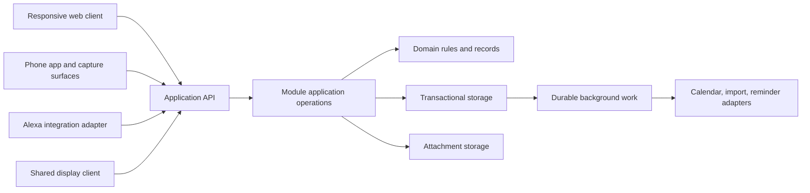

# Household app — architecture, iteration 1

Archived on 2026-09-25 before the second architecture review. The current plan is [ARCHITECTURE.md](ARCHITECTURE.md); subsequent decisions supersede this snapshot.

Date: 2026-09-25. Status: proposed architecture for discussion, with agreed requirements and storage directions identified below. SQLite with database BLOBs is the current working preference. No implementation, framework, final database configuration, or final class model has been selected.

This document begins architecture planning from [PLANNING.md](PLANNING.md). [DATA_MODEL.md](DATA_MODEL.md) maps the whole-app schema and shared storage conventions. [VOICE_INTEGRATION.md](VOICE_INTEGRATION.md) contains integration research and the device experiments still needed. Product examples below are intended to expose design consequences before implementation.

## 1. Design goals and method

The user explicitly wants carefully structured classes, modularity, reusability, naming symmetry, and an architecture that accommodates future features. Evaluate these through behaviour: a new capture entrance should reuse existing operations; a recipe import provider should be replaceable without rewriting recipe screens; a new view should not require duplicate household records.

Work in iterations. Each architectural decision should record the problem, constraints, alternatives, proposed choice, consequences, evidence still needed, and what would justify revisiting it. Distinguish proposed decisions from accepted ones. Detailed interfaces and schemas should follow agreed ownership and lifecycle rules.

Plan the parts whose assumptions spread widely before building: identity and visibility, record identities, time semantics, offline changes, attachment ownership, and durable background work. Concrete provider classes and visual layouts can change more locally when their contracts are clear.

The architecture should accommodate known variations without implementing every future feature now. Introduce reusable abstractions when their meaning is shared and demonstrate them against at least two actual workflows. A shared UI control, a shared domain policy, and a shared storage mechanism are different kinds of reuse.

## 2. Constraints that shape the design

| Product requirement | Architectural consequence |
| --- | --- |
| Two people, phones and computers, awkward existing sync | Define mutation acknowledgements, retries, concurrent edits, and offline scope before selecting a client data library. |
| Voice, widget, typed entry, pasted links | Several entry adapters should invoke the same application operations. An inbox is one destination, not a compulsory stop for every shopping entry. |
| Private gifts and personal work views | Authorisation must cover queries, linked records, files, cached views, activity, and external exports. Network access alone is insufficient to choose what a person can see. |
| Targets, deadlines, reviews, snoozes, actual completion | Separate these concepts in the model and use-case vocabulary. |
| Recipes, maintenance records, media-rich projects | Keep durable records and their attachments independent of the tasks or views that refer to them. |
| Home hosting with possible Tailscale access | Prefer a small operational footprint; specify behaviour when the home server is unreachable and how a full restore works. |
| External calendars, Alexa, optional LLM imports | Model external identifiers, failures, retries, and data ownership explicitly. Provider-specific code belongs behind narrow interfaces. |
| Visual browsing and configurable home screens | Share a design system and interaction rules; keep presentation projections separate from canonical record storage. |

Confirmed inputs: both phones are Android. Offline access uses read-only cached server data plus editable/deletable local inbox drafts. The user explicitly accepts locking a draft before its first submission attempt, including while acknowledgement is uncertain; changes then wait for creation resolution and an online update. Shopping check-offs require connectivity under this scope. Language/ecosystem preferences, the home server environment, and acceptable downtime remain open inputs.

## 3. Proposed deployment shape

The agreed storage direction is one host relational database for this two-person self-hosted application. Domain records, committed change history, submission receipts, job state, and other application metadata all live there. Each phone likewise uses one local database for its cache and pending captures. Logical data/metadata separation does not imply separate physical stores. SQLite with media BLOBs in the same database is the current working preference.

Start with one application server whose feature modules have explicit boundaries. This is a modular monolith: modules are code boundaries within one application, not separately deployed services. A background worker can initially run within that application using database-backed jobs. The reliability target is durable data through restarts, request interruption, retries, and upgrades, plus tested backup/restore. The server may be temporarily unavailable; failover infrastructure is not a current requirement.

The benefit for this household is coordinated changes, transactions, deployment, and backups with a small number of moving parts. The cost is shared runtime resources and failure scope. Long-running imports must be isolated from request handling, and module boundaries need enforcement through package dependencies and tests. Splitting a worker or integration later is possible, but would still require a deliberate data and transaction migration; interfaces do not make that free.

This diagram shows responsibilities rather than settled network routes. Alexa's cloud-to-home bridge remains a separate feasibility test. Both phones are Android, so there is no current iOS requirement. Compare a native Android client, a shared mobile framework, and a web shell with native capabilities using the actual capture/widget/cache requirements; this draft does not choose between them.

Rationale reference: [Monolith First](https://martinfowler.com/bliki/MonolithFirst.html) discusses the difficulty of fixing service boundaries before the domain is understood. The deployment choice here is a recommendation for this app, not a requirement to use microservices later.

## 4. Proposed domain ownership

These are candidate feature packages, introduced as their features are built. They are not instructions to scaffold every package or class immediately.

| Module | Owns | Boundary to preserve |
| --- | --- | --- |
| Access | Household membership, person/device identity, capability and visibility decisions | A shared speaker or kitchen display is not implicitly a personal user with access to private gifts. |
| Inbox | Captured text/links/media, original input, capture provenance, filing state | Filing links to or creates a domain record while retaining capture provenance; it does not duplicate the record's ongoing state. |
| Tasks | Actionable work, recurrence rules, occurrences, actual completion and corrections | Recipes and home assets are references, not subclasses of a task. Reminding and completing are separate operations. |
| Shopping | Active shopping entries, reusable restock items, purchase history | Buying and installing/replacing are different events. A recurring need can reuse a restock item without reopening an old purchase record. |
| Recipes | Saved recipes, source versions, collections, household adjustments, cooking history | Imports never overwrite household adjustments; collection moves preserve recipe identity. |
| Maintenance | Home assets, maintenance plans, service records | Reuse task scheduling/completion through an explicit workflow rather than a second recurrence implementation. |
| Projects | Project/page hierarchy, reference content and links | A task can appear on a project without copying it or inheriting unintended visibility. |
| Gifts | Gift suggestions and private gift plans | Private purchase state remains distinct from a shared suggestion; shared activity never derives from unrestricted gift data. |
| Reminders | Reminder requests, per-person snoozes, channel preferences and delivery attempts | Task target dates and recurring schedules belong to Tasks; calendar ownership remains with its source. |
| Views | Personal layout preferences, scoped pins, dashboard/agenda/activity queries | Views reference canonical records. A unified display is not a universal domain object. |

Supporting capabilities include attachment storage, typed record references, clocks/time values, persistence, and external adapters. Each must have an owner and a small contract; a miscellaneous `Common` package should not become the path around boundaries.

One module cannot write another module's tables directly. Cross-feature workflows call module operations. Where atomicity is necessary, an application-level coordinator can enlist both operations in one database transaction. This makes the dependency and transaction visible and avoids circular calls between feature modules. Read composition uses authorised query contracts or explicitly owned projections; joins and foreign keys across feature tables are appropriate within the shared database. Code ownership must not force duplicate records or artificial database isolation. Design the complete relationship map and schema conventions together before feature-by-feature DDL.

Attachments have stable identities, upload states, media metadata, and explicit links to parent records. Access must be checked when bytes or thumbnails are served. Linking a private attachment to shared content is an explicit sharing decision, not automatic permission widening. Typed references must detect missing/deleted targets; an arbitrary string containing an ID is not referential integrity.

## 5. Classes, composition, and naming

Give domain classes responsibility for their own meaningful state transitions and invariants. Use value types for concepts such as a local date, a time zone, a quantity, or a recurrence rule. Use ordinary functions for stateless transformations. Use interfaces where a real boundary exists: persistence, a clock, a provider, or a policy with multiple meaningful implementations.

Suggested layering inside a feature:

- **Domain:** entities, value types, invariants, domain policies; independent of HTTP, UI, database mapping, and provider SDKs.
- **Application:** use cases, authorisation, transaction coordination, and interfaces needed by those use cases.
- **Adapters:** persistence implementations, API endpoints, import providers, and other external integrations.

Keep client presentation code separate. Shared wire contracts can be generated; they should not expose mutable server entities or require every client to use the backend language. The server remains the authority for business rules even when clients duplicate some validation for responsive feedback.

| Role | Naming convention | Examples |
| --- | --- | --- |
| Domain entity | Singular domain noun | `Recipe`, `ShoppingEntry`, `TaskOccurrence` |
| Typed identity | Entity name plus `Id` | `RecipeId`, `ShoppingEntryId`, `TaskOccurrenceId` |
| Use case/command | Explicit verb plus object | `SaveRecipeLink`, `CreateTask`, `CompleteTaskOccurrence`, `RescheduleTaskOccurrence` |
| Query | Read verb plus result/scope | `GetRecipe`, `ListRecipes`, `GetPersonalOverview` |
| Domain event | Completed fact in past tense | `RecipeSaved`, `TaskOccurrenceCompleted`, `ShoppingEntryPurchased` |
| Boundary interface | Domain capability | `RecipeExtractor`, `AttachmentStore`, `ReminderChannel` |
| Adapter | Specific implementation plus capability | `SchemaRecipeExtractor`, `LlmRecipeExtractor`, `FileAttachmentStore` |

These names are provisional but the symmetry is intentional. Pick one vocabulary and apply it across code, API contracts, tests, and documentation. Keep exceptions explicit: `Complete`, `Purchase`, `Cook`, `Snooze`, and `Reschedule` describe different facts and should not all become `SetDone`. Avoid vague `Manager`, `Helper`, or `Service` types when the responsibility has a concrete name.

For symmetric controls, use explicit operations such as `PinRecipe`/`UnpinRecipe` or a command that sets desired state. Replaying a `Toggle` after a network timeout can reverse the intended result. An undo is not always a literal inverse: correcting an actual completion may affect the next recurring occurrence, so it needs its own rule.

Prefer composition to a hierarchy such as `HouseholdItem -> Task -> RecipeTask`. Shared titles, notes, references, or pin controls do not make recipes, purchases, and tasks substitutable. Introduce a common abstraction only when its operations have the same meaning for every implementation.

## 6. Data and lifecycle decisions to resolve next

### Tasks and time

Candidate model: `Task` owns the work definition and optional recurrence policy; `TaskOccurrence` represents a particular actionable instance; `TaskCompletion` records actual work and who did it. Using an occurrence for one-off tasks would make completion APIs consistent, at the cost of an extra entity. Compare that against special-casing one-off tasks before committing the schema.

Represent deadlines, flexible targets, and review dates with explicit meaning; a record may need both a genuine deadline and an earlier reminder. Store completion instants separately from local dates and calendar times. Fixed schedules need a time zone and daylight-saving rules; completion-based recurrence needs a policy for corrected or backdated completion. A pin has ordering and personal/household scope, with no implicit due date.

A recurring occurrence needs a stable identity so simultaneous completion from two devices does not advance the schedule twice. Define reopen, skip, undo, schedule edit, and late completion behaviour before implementing recurrence. Keep one active missed occurrence by default, as proposed in the product plan.

### Shared edits and offline operations

Proposed first offline contract, based on the user's refinement:

| Data or operation | Offline behaviour |
| --- | --- |
| Previously synced recipes, projects, tasks, inbox, shopping | Browse an authorised cached copy; existing records are read-only. |
| New inbox capture on this phone | Save durably as a local draft with a stable identity; permit editing/deletion until it is frozen before first submission. |
| Shopping check-off, task completion, moving a recipe, editing/deleting an existing inbox entry | Requires connectivity under this proposal. Offline shopping means browsing the list. |
| Reconnection | Refresh cached records and submit pending captures; show which entries are still local, sending, accepted, or need attention. |

Cache the data the current person is permitted to read, rather than copying a raw production database containing other people's private gifts, integration secrets, or server-only job state. A local database can hold this read cache and a separate draft store. The local schema and engine need not match the server. Choose the initial cache coverage and attachment/download policy explicitly: thumbnails and selected recipe details are different storage commitments from every original photo and receipt. Show the last refresh time and distinguish uncached content from absent content.

Useful client responsibilities are `ReadCache`, `CaptureDraftStore`, and `CaptureUploader`. A `CaptureDraft` is a local editable object; an `InboxEntry` is an accepted server record. They can appear together in the inbox UI with distinct sync state, without treating the read cache as a writable replica. Refreshing the cache must never erase unsent drafts. Each draft belongs to its author/device context; changing signed-in person must not expose another person's cache or drafts.

Use local form-draft persistence for unfinished text/new items, separate from the shared record history and the editor's in-memory undo stack. A recovered existing-record editor retains its base revision and requires an online conditional save. Draft persistence alone never requests submission: the uploader only freezes captures explicitly marked ready by Save/Submit or the agreed capture-complete event. Preserve the latest draft before camera/gallery launch and deliberate navigation; surface persistence failures. Cross-device draft sync is not an initial requirement.

Camera, gallery, shared images, and desktop file/paste inputs feed the same attachment acquisition/staging capability. On Android, the system [Photo Picker](https://developer.android.com/training/data-storage/shared/photo-picker) supports selected-media access, and [TakePicture](https://developer.android.com/reference/androidx/activity/result/contract/ActivityResultContracts.TakePicture) is a candidate camera adapter. Stage durable app-owned bytes for deferred upload instead of depending solely on an external content URI. Keep acquisition state separate from completed attachments; cancellation or unavailable cloud content must not discard the form. Device/library integration remains unimplemented and requires testing.

The agreed handoff direction is `DRAFT -> SUBMITTED -> ACKNOWLEDGED`. In a short local transaction, freeze a ready capture's create payload and attachment manifest and mark it `SUBMITTED` before its first submission/upload request. Require all selected media to be durably available locally first. Local edits/deletes must check that the record is still `DRAFT`; frozen attachment bytes/identities follow the same rule. No database lock stays open across network I/O. A timeout or restart leaves the immutable submission available for retry rather than reopening local editing.

Use one stable client capture ID and exactly the same create payload for retries. A server uniqueness constraint scoped to household/author/capture arbitrates concurrent requests; commit the inbox entry, immutable creation receipt, and required background work together. A matching replay returns the original receipt without overwriting the entry. Changed payload under the same key is rejected. Retain receipts or tombstones after editing, filing, and deletion so late retries cannot resurrect records.

An online Edit first resolves the creation, obtains the current record/revision, then uses the ordinary online update contract. Connectivity alone does not prove whether creation happened. There is no post-submission local editing/cancellation queue under this decision. An uncertain submission remains read-only until resolved, an explicitly accepted interaction cost. Creation idempotency does not eliminate simultaneous online edits or the need for separate retry semantics on update/delete.

See [A04: Freeze inbox captures before submission](decisions/0001-offline-capture-submission.md) for the provisional relational schema, transition ordering, replay behaviour, receipt lifetime, and acceptance scenarios.

For normal online edits, specify conflicts by operation: text edits can require an expected revision; independent new notes can coexist; delete versus edit needs a recoverable conflict. Domain uniqueness checks must also prevent two different commands from completing the same occurrence twice. A cache change feed needs ordering/cursors, deletion notices, and a full-refresh path. Permission changes remove now-inaccessible cached records on reconnect; already downloaded data cannot be retroactively made unseen.

HTTP conditional requests are one possible expression of expected revisions: [RFC 9110, If-Match](https://www.rfc-editor.org/rfc/rfc9110.html#section-13.1.1) describes preventing lost updates. The final protocol and retention of deduplication records remain decisions. Broader offline mutation support can be a later explicit feature without changing the domain record identities.

### Durable jobs, notifications, and integrations

Commit a record change and any required follow-up work in the same local transaction. A worker then retries delivery/import separately. Give reminders, calendar exports, and import results stable identities and explicit states. Only acknowledge shared storage after commit; queued work is a distinct acknowledgement.

This is the transactional outbox principle. It prevents a committed change from losing its required follow-up because of a crash between two writes; it still requires duplicate handling at the receiver. [AWS transactional outbox guidance](https://docs.aws.amazon.com/prescriptive-guidance/latest/cloud-design-patterns/transactional-outbox.html)

Recheck reminder eligibility and current visibility before sending, since a task may have completed or become private after a job was scheduled. Define quiet periods and cancellation races when designing the delivery contract. External services may not support deduplication, so do not promise exactly-once notification delivery.

Keep external calendar event IDs and source ownership separate from tasks. Start with read-only work agenda aggregation and explicit household calendar operations; bidirectional edits need their own conflict policy. Recipe extraction returns an import draft, not unrestricted commands against household data.

### Persistence and recovery

Use one transactional relational database for linked domain records and operational metadata. SQLite with BLOB tables is the working preference; review the library, durability settings, backup procedure, and disk reclamation policy alongside the stack. An attachment interface does not require an external object store. Host-managed files remain a possible future alternative if measured media or backup costs justify coordinated file/database lifecycles.

Propose current relational state plus append-only logical change sets, committed atomically with receipts and required jobs. Read-only history supports browsing and copying old content. Recent undo/redo targets the current person's actions, advances revisions, and rejects later conflicting row/dependency changes without merge dialogs. Media replacements change immutable object references; retain unreferenced bytes for roughly 24 hours, possibly less under storage pressure, then preserve historical metadata and source URIs where available. [A09: Record history and media retention](decisions/0002-record-history-and-media-retention.md) covers person attribution, reversal checks, visibility, and best-effort recovery from media sources.

Settings > Storage reports database storage on this device and the server, with measurement times, an explicit refresh, and cached server results when offline. A small storage query adapter supplies sizes; the host reports aggregate statistics through the normal API. [DATA_MODEL.md](DATA_MODEL.md#8-storage-measurements-for-settings) defines proposed accounting so media is not counted twice and reusable database space is distinguished from filesystem reclamation. No live metrics infrastructure is required.

Design the whole known schema as one coherent model: common identity/attribution, naming, reference, visibility, time, revision, quantity, deletion, and migration conventions. Plan the relationships across all feature modules, then implement tables incrementally through one migration history. [DATA_MODEL.md](DATA_MODEL.md) contains the first inventory and the decisions to resolve before detailed DDL.

Plan schema migrations and client/API compatibility from the first build. Backups must include attachments and the database in a consistent recoverable set; perform a restore exercise. Define deletion/undo and retention so offline clients cannot silently resurrect deleted records. Export should preserve stable links between recipes, notes, tasks, media, and provenance.

## 7. Worked cross-feature example

1. A person pastes a recipe URL. `SaveRecipeLink` stores a recipe record and required import work atomically, then returns the recipe identity immediately.
2. Import work reads the source and uses a `RecipeExtractor`: structured metadata first, optional LLM extraction later. The result includes source information and missing fields. Applying it checks the current recipe/import revision and preserves newer manual edits and household notes.
3. `PinRecipe` marks it for Soon in the chosen personal or shared scope. The recipe remains in Want to try or Favourites.
4. `CreateTask` makes an actionable task linked to that recipe. It owns its target, occurrence, and optional reminder; no recipe is copied or converted into a task.
5. Selected ingredients create linked shopping entries through the Shopping module. Retrying the same operation cannot duplicate the additions; handling an independently requested duplicate is a separate user/domain decision.
6. Completion records actual cooking time and can produce a linked cooking-history entry. Replaying that occurrence's completion cannot create a second history entry. A permanent adjustment note is stored with the recipe independently of this particular attempt.

Run the same boundary check for a furnace filter: a home asset owns its service context, a restock item identifies a compatible replacement, shopping records buying it, and task completion records installation. Reuse scheduling and linking; preserve the different meanings of purchase and installation.

## 8. Presentation architecture

Use shared design tokens, responsive layout primitives, and consistent interactions: card/list presentation, explicit Save/Cancel, edit/delete/undo, date picker plus postponement presets, and Ctrl+Enter for the active form. Feature screens compose those parts while retaining their own domain language.

A configurable overview chooses registered section types, order, count, filters, and work/home scope. The first registry can be ordinary code plus versioned user preferences; it does not require a plugin system. Widget and display projections have their own audience and space constraints. Reuse permitted queries and formatting rules while preserving native interaction needs.

Do not assume a single UI technology can implement desktop layouts, Android widgets, lock-screen capture, and a durable local cache equally well. Both current phones are Android. Compare alternatives with a small real capture/sync slice and device testing before committing to a mobile framework; retain an API boundary that would allow another client platform later.

## 9. Decisions and their change costs

Recommendations remain proposed except where a row records a direction explicitly agreed in conversation. Agreement on direction does not imply that its detailed protocol or implementation has been validated.

| ID | Decision | Starting proposal | Consequence or alternative to examine |
| --- | --- | --- | --- |
| A01 | Deployment and module boundaries | One modular server plus durable worker | Small operational footprint, shared failure scope; separate services only when isolation or independent operation justifies their contracts. |
| A02 | Record model | Distinct domain records with typed links and composed capabilities | More explicit types, fewer ambiguous flags; a universal item model makes cross-feature rules and migrations harder to constrain. |
| A03 | Identity and privacy | Paired devices, person/household identity, server-enforced visibility | Some identity setup remains even on trusted LAN; private gifts and personalised views depend on it. |
| A04 | Offline ownership — agreed direction | Authorised read cache; local drafts freeze before first submission and retry idempotently until acknowledged | Avoids general offline merge; submitted captures stay read-only until resolution. See the linked decision for schema and protocol detail. |
| A05 | Client/platform stack | Compare responsive web plus native Android capabilities against shared/native clients | Both phones are Android; lock-screen capture and durable caching drive the comparison. Language/framework selection is deferred. |
| A06 | Persistence — agreed direction | One host relational database for all domain data and operational metadata; one local database per phone | Whole-app schema design precedes feature DDL. SQLite with database BLOBs is now the working preference; configuration remains open and backup/restore is the principal recovery mechanism. |
| A07 | Extension mechanism | Narrow provider interfaces and in-process use-case contracts | Replaceable integrations with ordinary code; avoid committing to a public plugin ABI before a need exists. |
| A08 | Side effects | Durable work records and retry-safe consumers | More explicit job states; avoids coupling save success to calendar, notification, or LLM availability. |
| A09 | Record history and media retention — goals agreed, mechanics proposed | Current records plus deltas for read-only history and recent personal undo; whole media replacement with deferred collection | Undo/redo rejects later conflicts and never targets the other person's action. Retain source URIs for possible recovery after bytes expire; a URL does not guarantee the original image. See the linked decision. |

Record each accepted decision with rejected alternatives, residual risks, and a revisit trigger. Choices such as provider adapters are relatively local; changing sync semantics or public record identities after multiple clients ship is more disruptive. Compare alternatives against concrete requirements rather than assigning unsupported numerical scores.

## 10. Iterative design sequence

| Iteration | Reviewable output | Evidence that the iteration is ready |
| --- | --- | --- |
| 1 — Current | Domain vocabulary, module ownership, candidate deployment, decision map | Agree on the major entities and their distinct meanings; identify disputed boundaries. |
| 2 | Whole-app ER model, shared schema conventions, state transitions, visibility, command/query contracts, offline protocol | Walk through recipe-to-task, purchase-to-installation, snooze/completion, simultaneous edits, and private-gift views without incompatible table conventions or ambiguous ownership. |
| 3 | Stack alternatives, package layout, a few concrete class/interface examples | Compare actual mobile surfaces, maintainability, deployment, testability, and cross-language sharing using the same requirements. |
| 4 | Integration and operational contracts, migrations, backup/restore, failure reporting | Understand behaviour when a provider, network, or home server fails and how data is recovered. |
| 5 | Plan a small end-to-end implementation slice and architecture checks | Demonstrate capture or shopping from client through persistence and retry before building every feature package. |

Device feasibility work may run earlier when needed to decide iteration 3. No production build or device configuration is started by this document.

Useful acceptance scenarios for later implementation: offline browsing shows its refresh state; editing/deleting a draft before submission stays local; cache refresh preserves pending captures; a crash after local freeze retries the same snapshot; lost response then retry creates one entry; submitted captures remain immutable until resolved; late create retries never overwrite edits or resurrect deleted entries; two phones complete one occurrence; buying a part leaves installation history unchanged; snoozing preserves actual deadlines; a recipe re-import preserves adjustments; a private gift stays absent from shared counts/thumbnails; a reminder queued before completion is suppressed where still cancellable; a restored backup opens both records and their attachments. These verify behaviour and module contracts, rather than class layout alone.

History/media scenarios: a retry adds no duplicate change set; a historical view/copy does not modify current state; undo/redo targets the current person's actions and rejects conflicting edits while allowing unrelated changes; private historical values remain private; a stale collection job cannot delete reattached or otherwise live media; source recovery distinguishes original from changed bytes; collected bytes leave understandable history and explicitly limit media restoration. Storage settings show dated phone/server sizes and retain the last server reading when offline.
