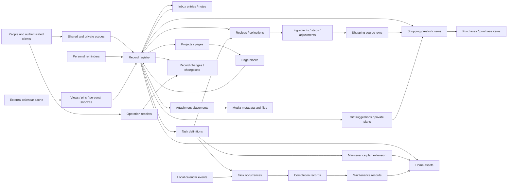
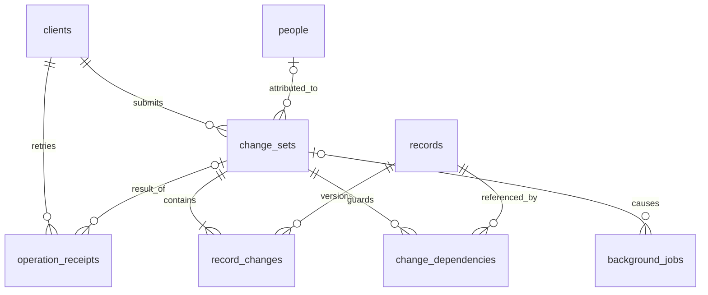
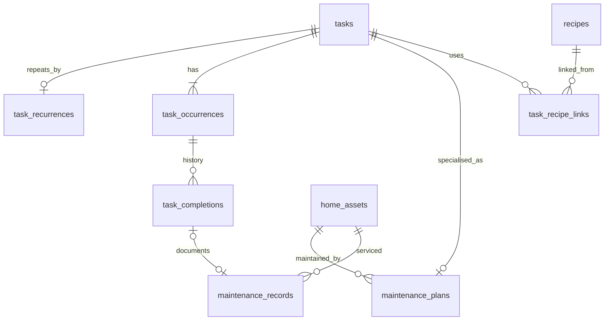

# Household app — connected database model

Date: 2026-09-26. Status: **design proposal for review**, grounded in the agreed product, offline, history and file-storage requirements. This is a connected logical model, not a production schema or framework selection. The [earlier inventory](DATA_MODEL_ITERATION_1.md) is preserved.

Read the [worked transactions](WORKED_TRANSACTIONS.md) alongside this model: they show what commits together and test the module boundaries. Existing contracts remain in [architecture](ARCHITECTURE.md), [offline submission](decisions/0001-offline-capture-submission.md), [history and retention](decisions/0002-record-history-and-media-retention.md), and [file storage](decisions/0003-file-media-and-container-storage.md).

The subsequent [application contract pass](APPLICATION_CONTRACTS.md) specifies typed commands/results, terminal rejection, targeted no-op rules, history codecs and module interfaces. The user has authorised continuing the plan; proposals remain revisable.

[Stack selection](STACK_SELECTION.md) now chooses a working implementation arrangement. [Restore reconciliation](RESTORE_RECONCILIATION.md) adds installation/recovery metadata so restoring an old backup cannot masquerade as ordinary continuous operation.

## 1. Main choices

| Proposed choice | Why it fits | Cost or limit |
| --- | --- | --- |
| One host SQLite database, media files beside it | Domain state, history, receipts and jobs share a SQL transaction. | Files require recoverable publication/collection outside SQL atomicity. |
| Thin `records` registry for independently addressable content | History, attachments, pins and page links get real FK targets across features. | Extra join and a transaction check for complete typed payloads. |
| Typed payload tables and domain relationships | A task is distinct from a recipe; ingredients reference recipes. | New features need ordinary migrations and explicit behaviour. No universal `Item` payload or superclass. |
| Separate task definition, occurrence and completion | Repetition, current work and what actually happened evolve independently. | Completing a recurring task changes several related records atomically. |
| Current state plus logical changesets | Simple current queries, read-only history, conservative recent undo. | History codecs and inverse guards are maintained application code. |
| Explicit scope and relationship ownership | Private plans can reference shared suggestions without modifying shared state. | Queries and cross-scope links need access checks; FKs alone are insufficient. |

This plans the known scope without implementing every table immediately. One database and one modular server suffice; no general offline merge, event-sourced query model, universal workflow engine or separate job service is proposed.

## 2. Connected map

Arrows denote relationships, not ownership of everything referenced. The catalogue supplies precise cardinalities and foreign keys. Registry cycles mean links between different records, not recursive object construction; screens fetch bounded projections.



## 3. Conventions and ownership

- One household per installation; `household_settings` is a singleton. Multi-household hosting would be a deliberate future migration, not tenant IDs on every row now.
- Stable opaque IDs use non-null text consistently in this proposal. Clients can generate capture/media IDs offline. IDs never confer permission and are never reused after deletion.
- Tables are plural; keys name the entity (`recipe_id`). **R** in the catalogue means a typed root whose PK is also its registry FK; it does not add a duplicate `record_id` column. `?` denotes optional fields. Required keys are explicitly `NOT NULL`.
- `_at` is a UTC instant, proposed integer epoch milliseconds; `_on` is an ISO date. Store IANA timezone for recurrence/appointments. Date-only and timed alternatives are mutually exclusive. Date-only does not mean UTC midnight.
- Money uses integer minor units plus currency. Keep original quantity/ingredient text; optional parsed amounts use exact decimals and units, without guessing conversions.
- JSON holds versioned history deltas, provider snapshots and presentation preferences. Core domain relationships use foreign keys.
- A content action advances each affected root revision once, including owned-child edits. Creation starts at 1; undo also increases revisions.
- A relationship belongs to its source. Adding a private plan's link to a shared suggestion does **not** change the suggestion revision, activity or visible backlink count. Recipe ingredients belong to their recipe; blocks belong to their page.
- Roots are soft-deleted with retained identity and typed payload initially. Archive hides inactive material but retains bytes. Retire children needed by provenance/history; do not cascade away receipts or history. Permanent content purge is outside the initial feature set.

The catalogue gives keys, semantic fields, cardinalities and constraints, rather than every timestamp/index/enum declaration. Operational upload/cache rows can expire independently of durable content.

## 4. Identity, access and registry

| Table | Keys and main fields | Relationships / invariants |
| --- | --- | --- |
| `household_settings` | singleton key; name, timezone, retention preferences | Installation defaults. |
| `installation_state` | singleton key; installation ID, recovery epoch, restored-from time?, recovery mode | Epoch changes on supported restore, not ordinary restart. New mutations require their expected epoch; surviving receipts can still resolve. |
| `people` | `person_id`; display name, timezone, active | Two initially; disabled identities remain for attribution. |
| `clients` | `client_id`; kind, `person_id?`, label, enabled | Personal clients belong to a person; shared speaker/integration/worker clients may have no human. Reassigning a device to another person creates a new logical client identity. |
| `client_credentials` | `credential_id`; `client_id`, verifier/secret reference, expiry/revocation | Many rotating credentials per stable client. Secrets are excluded from content caches/history. Authentication protocol remains later work. |
| `visibility_scopes` | `scope_id`; kind `shared/private`, `owner_person_id?` | One shared scope, at most one private scope/person. Private requires owner, shared forbids owner. Membership is immutable. |
| `records` | `record_id`; kind, `scope_id`, revision, created/updated/archived/deleted times | Exactly one concrete typed payload. No generic title/body/status. ID/kind immutable; scope changes are explicit operations. |

Personal clients access shared and their own private content; shared clients access shared content. Authentication supplies attribution. A speaker saying a person's name is not authentication. Null human actor means unknown human, with the client still identified.

### Subtype constraint

Define `UNIQUE(record_id, record_kind)` on the registry, then a constant kind and composite FK on each typed root:

```sql
CREATE TABLE notes (
    note_id TEXT NOT NULL PRIMARY KEY,
    record_kind TEXT NOT NULL DEFAULT 'note' CHECK (record_kind = 'note'),
    title TEXT NOT NULL,
    body TEXT NOT NULL,
    FOREIGN KEY (note_id, record_kind)
        REFERENCES records(record_id, record_kind)
);
```

This prevents the wrong payload kind and two different payload kinds for one ID. It does **not** require every registry row to have a payload: the coordinator checks that before committing atomic root/payload creation. That obligation is the main cost of the registry; an integrity audit can detect violations independently.

Explicitly enable and verify foreign keys on every connection. Composite parent keys require appropriate primary/unique constraints. These are database requirements, not consequences of naming conventions. [SQLite foreign keys](https://www.sqlite.org/foreignkeys.html)

### Audience rules

Containment normally requires equal scopes: list/entry, project/page, task/occurrence/completion, attachment/media/parent. Initial sharing uses explicit copy/share workflows for connected content; arbitrary scope moves are not promised.

A private source may reference a shared target. A shared source cannot expose a private target. Check permission at link creation and on later reads: deletion or scope changes must not leave a readable cached private title/thumbnail. Domain FKs establish existence, not authority.

Non-owning links, including private gift-plan links, tolerate a tombstoned target and cannot veto its deletion or undo. Otherwise a rejected shared operation could disclose a hidden private reference. Inverse checks distinguish these links from same-scope business dependencies, such as a purchase that consumed a shopping entry. Do not expose private reference counts or reasons through validation errors.

History requires both current access and access to the historical version. Making a private note shared does not reveal its private past: record an explicit after-state snapshot as the new audience's visible baseline, omitting private before-values from that audience's projection. Backward reconstruction stops at that boundary. Render authorised record changes without hidden-record counts, unfiltered action summaries or user-visible gaps in internal commit sequence numbers.

## 5. History, operation receipts and jobs



| Table | Keys and main fields | Invariants |
| --- | --- | --- |
| `change_sets` | `change_set_id`; unique commit sequence, client, actor person?, operation kind, recorded time, cause changeset?, undo-of?, redo-of? | One content action, possibly many roots. Undo-of references the action undone; redo-of references the Undo action reversed. Those references are mutually exclusive. Worker causality does not pretend a worker is a human. |
| `record_changes` | PK `(change_set_id, record_id)`; before/after revision, before/after scope, payload version, delta JSON | One delta per root/action including owned-child changes with stable IDs. Creation includes full non-binary baseline; later deltas retain old/new values. |
| `change_dependencies` | PK `(change_set_id, record_id, role)`; expected post-action revision | Additional revision guards for safe inverse. New-reference predicates still require transactional rechecking. |
| `operation_receipts` | PK `(client_id, operation_id)`; digest, actor person?, outcome, changeset?, minimal result JSON, recorded time | Digest includes canonical operation kind/version, stable authenticated client/person identity, payload and media manifest; excludes rotating tokens and retry headers. Same key/different digest is rejected. Receipts outlive deleted results. |
| `background_jobs` | `job_id`; kind, unique dedupe key, target record?, cause changeset?, versioned payload, run-after, state, lease, attempts/error | Created with originating action, executed after commit. Retrying work does not duplicate its applied content changes. |

Write path: authenticate → short write transaction → resolve receipt → check access/revisions/invariants → change typed state → append deltas → save jobs and receipt → commit. Resolve matching retry before reapplying its mutation. Current-record retrieval is a separate authorised read; a receipt must not leak stale private content after access changes.

An accepted no-op or preference/operational mutation may have a receipt without a content changeset. Terminal rejection may be persisted only after ensuring no partial mutation remains, with rejection receipt arbitration inside the same serialised write transaction. If the transaction aborts, a new attempt must resolve any winning receipt before recording a final rejection; do not report terminality first. Connectivity/authentication failures are not proof of rejection. SQLite permits one writer at a time; short `BEGIN IMMEDIATE` writes suit this deployment. Keep file/network work outside, and retry a whole bounded operation after contention, not only its final statement. [SQLite transactions](https://www.sqlite.org/lang_transaction.html)

Journal durable content, not credential rotation, upload progress, GC, delivery retries or draft keystrokes. Layout preferences and personal attention controls initially sit outside saved-content undo. Versioned history codecs must remain interpretable across migrations; retaining opaque JSON alone is insufficient.

## 6. Inbox, notes and app feedback

| Table | Keys and main fields | Relationships / ownership |
| --- | --- | --- |
| `inbox_entries` (R) | `inbox_id`; captured text/time, source kind/URI, filed time? | Text, attachments or both; photo-only valid. |
| `inbox_destinations` | PK `(inbox_id, target_record_id)`; filed time | Zero or more destinations, owned by inbox. Filing does not change registry kind. |
| `notes` (R) | `note_id`; title, body, format | Standalone reusable text with attachments. |
| `note_links` | PK `(note_id, target_record_id)` | Source-owned links; target revision unchanged. |
| `app_suggestions` (R) | `suggestion_id`; title, body, status, source screen, versioned client context? | In-app improvement requests; normal attachments/scope. No automatic external posting. |

Filing preserves capture provenance; the destination owns continuing task/recipe/project state. Deleting a destination leaves the original capture and an authorised unavailable-target placeholder. Undoing filing unlinks/restores inbox state; removing a newly created destination additionally requires dependency and revision checks.

## 7. Tasks, recurrence and maintenance



| Table | Keys and main fields | Relationships / rules |
| --- | --- | --- |
| `tasks` (R) | `task_id`; title, instructions, context `home/work`, default assignee?, default priority | Definition. One-off tasks also have an occurrence. |
| `task_recurrences` | PK/FK `task_id`; mode `fixed/after_completion`, interval count/unit, anchor date, timezone, versioned schedule specification | Zero/one per task; task-owned. One recurrence module validates it. No hidden record IDs in JSON; exact supported fixed patterns remain a contract decision. |
| `task_occurrences` (R) | `occurrence_id`; task, ordinal, state, nominal date?, assignee?, priority, deadline date/instant?, target date/instant?, review date? | Many/task over time; unique `(task_id, ordinal)`; **at most one open/task** initially. Occurrence changes do not silently edit task defaults. |
| `task_completions` (R) | `completion_id`; occurrence, actual completed time, completing person?, notes, voided time? | At most one unvoided completion/occurrence. Recording time comes from changeset. |
| `task_recipe_links` | PK `(task_id, recipe_id)`; purpose | Typed link owned by task. |
| `home_assets` (R) | `asset_id`; name, model, serial?, location, acquired date? | Appliance/room/system, photos and documents. |
| `maintenance_plans` | PK/FK `task_id`; asset, maintenance-specific instructions/reference | Extension of task, with no separate recurrence engine/registry ID. |
| `maintenance_records` (R) | `maintenance_record_id`; asset, unique completion?, occurred time, notes, cost/currency? | Service log; can be historical without marking today's task complete. |

Partial unique indexes enforce one open occurrence and one unvoided completion. Their predicates cannot join registry deletion state, so deletion explicitly closes/voids domain state in the same transaction. Agreement between occurrence state and completion existence is an application transaction invariant. [SQLite partial indexes](https://www.sqlite.org/partialindex.html)

Proposed recurrence policy:

- After-completion recurrence uses **actual completion** in the rule timezone. A late report may generate a target already in the past; do not silently reset to today.
- Fixed-calendar recurrence keeps phase and coalesces missed slots. Propose the first slot after the latest of nominal occurrence date, actual completion date and recording date. This avoids a manufactured backlog and remains a product choice to review.
- Skip creates no completion. Fixed recurrence advances; after-completion recurrence needs an explicit new target because nothing was completed.
- Postpone explicitly changes target/review date; personal snooze leaves those dates intact. Moving a true deadline requires an explicit deadline edit.

Rule edits leave past completions unchanged. Record the calculation's rule version/inputs in action history so the next date can be explained. Suggested maintenance templates create ordinary tasks after selection. Buying a replacement part never implies installing it.

## 8. Shopping, purchases and gifts

| Table | Keys and main fields | Relationships / rules |
| --- | --- | --- |
| `shopping_lists` (R) | `shopping_list_id`; name, purpose | Groceries, wants, private gifts or user grouping. |
| `restock_items` (R) | `restock_item_id`; name, model/size, product URL, default quantity text | Reusable exact product with optional photo. Tasks/reminders can reference it. |
| `shopping_entries` (R) | `shopping_entry_id`; list, restock item?, label, quantity text, parsed amount/unit?, state `needed/purchased/cancelled`, position, notes | Same scope as list. Partial unique `(list, restock item)` when needed and restock is not null. Freeform duplicates allowed. |
| `purchases` (R) | `purchase_id`; bought time, buyer?, merchant?, total/currency?, notes | One scope, with receipt attachments. |
| `purchase_items` | `purchase_item_id`; purchase, shopping entry?, label/quantity snapshots, amount? | Many lines/purchase, owned by purchase; referenced shopping entry has the same scope. Entry can be referenced over time; initial UI treats purchase as full completion. Partial quantity accounting deferred. |
| `gift_suggestions` (R) | `gift_suggestion_id`; suggested by?, intended person? or recipient label, description, URL? | Can be shared; no private purchase-state fields on shared suggestion. |
| `gift_plans` (R) | `gift_plan_id`; recipient person? or label, suggestion?, idea, status, occasion date? | Private giver plan or shared outside-recipient plan. |
| `gift_plan_items` | PK `(gift_plan_id, shopping_entry_id)` | Plan-owned; same scope. |

“Need this” returns the existing needed entry for that restock item/list or creates a new entry. It never toggles or revives purchased history. Quantity changes are explicit; do not sum unparseable text. Moving to a list already containing that needed restock item requires explicit combine/keep handling or a rejected conflict.

A private plan → shared suggestion link changes no shared state. Private shopping, purchase, reminder and media rows stay private. A receipt containing groceries and a secret gift remains private unless a redacted copy is explicitly shared; separate purchase records represent the audiences. No private backlinks/counts/search/notification/activity leak through shared screens. See the [gift transaction](WORKED_TRANSACTIONS.md#6-private-gift-planning).

## 9. Recipes and cooking

| Table | Keys and main fields | Relationships / ownership |
| --- | --- | --- |
| `recipes` (R) | `recipe_id`; title, description, yield text, servings?, active import? | Current recipe. Card image uses an attachment role. |
| `recipe_imports` | `recipe_import_id`; recipe, source URL, retrieved time, extractor/version, source snapshot, expected revision, state | Immutable source snapshot plus operational application state. Unique job/result identity; active import belongs to this recipe. Limit retained snapshots rather than storing arbitrary entire sites. |
| `recipe_ingredients` | `ingredient_id`; recipe, position, original text, parsed quantity/unit?, retired time? | Recipe-owned; stable ID, unique `(recipe_id, ingredient_id)` for composite FK. |
| `recipe_steps` | `step_id`; recipe, position, instructions, retired time? | Recipe-owned. Never reuse an old ingredient/step ID for different content after reimport. |
| `recipe_adjustments` | `adjustment_id`; recipe, person?, body, created/updated/deleted times | Recipe-owned household notes; import cannot overwrite. |
| `recipe_collections` (R) | `recipe_collection_id`; name, built-in role? | Want to try/Favourites are initial collections, not exclusive states. |
| `recipe_collection_memberships` | PK `(recipe_id, recipe_collection_id)`; position, removed time? | Owned by recipe; revises recipe, not collection metadata. Initially equal scopes. Collection deletion checks memberships. |
| `recipe_shopping_sources` | `source_id`; shopping entry, recipe, ingredient?, recipe revision, ingredient/quantity snapshot | Shopping-entry-owned provenance. Composite FK proves ingredient belongs to recipe. Several sources may deliberately contribute to one entry. |
| `recipe_cooking_records` (R) | `cooking_record_id`; recipe, unique completion?, cooked time, person?, notes | Optional history with/without scheduled task; persistent adjustments stay on recipe. |

Collection moves remove/add membership without changing identity or notes. “Let's make this soon” is an independent view pin. Planning to cook creates a normal linked task; explicitly selected ingredients create shopping entries with provenance. Neither pantry tracking nor a recommender is assumed.

URL import creates a placeholder plus job. Extraction and picture staging run outside SQL. Apply against expected recipe revision; if it changed, retain a reviewable result instead of overwriting edits. Initially even an unrelated note conservatively blocks automatic application. Optional LLM extraction feeds the same validated import contract, never direct database writes.

## 10. Projects and mixed-media pages

| Table | Keys and main fields | Relationships / rules |
| --- | --- | --- |
| `projects` (R) | `project_id`; title, description | Archive retains references. |
| `project_pages` (R) | `page_id`; project, parent page?, title, position | Many/project; same scope. Unique `(project_id, page_id)` enables composite parent FK preventing cross-project parenting. |
| `page_blocks` | `block_id`; page, position, kind, text? / URL? / target record? / attachment? | Exactly one appropriate payload. Record card links live content; attachment block displays saved bytes. Composite `(page_id, attachment_id)` FK ensures placement belongs to page. |

Parent existence/same project are SQL constraints; no cycles requires a transactional ancestor walk. Page moves retain IDs/media. Blocks have stable history identities without separate registry roots. View pins hold prominent next actions separately from reference blocks.

Project deletion explicitly tombstones contained pages and retires blocks/placements in one bounded action. It does not delete tasks/recipes merely linked from pages. Restore checks every affected revision and parent rule. A staged huge-project deletion workflow is unnecessary initially.

## 11. Media files and placements

| Table | Keys and main fields | Relationships / lifecycle |
| --- | --- | --- |
| `attachments` | `attachment_id`; record, media, role, caption, position, removed time? | One parent/placement; many placements can reuse same-scope media. Unique `(record_id, attachment_id)` supports block ownership FK. Placement edits revise parent. |
| `media_objects` | `media_id`; scope, creator client, digest, length, MIME, source URI/page URI?, retrieved time?, storage key?, generation, state `staging/ready/deleting/collected`, unreferenced/GC/collected times? | Logical identity survives collection. Physical key unique when present. Scope/digest immutable; replacing bytes creates new media ID. |
| `media_variants` | `variant_id`; media, generation, kind, storage key, digest, size, state | Derived thumbnails with same audience, reconstructible if original remains. |
| `media_uploads` | `upload_id`; client, media, immutable request digest/expected hash/size, lease, state | Idempotent upload and publication protection. Client-generated media ID is already in frozen manifest. |

Here an **attachment is a placement**, while media owns bytes/provenance. Two placements can share one object; deleting one does not remove the other. Live means placement not removed and parent not deleted; archive remains live. History-only references do not indefinitely pin bytes. Last live reference removal starts approximately 24-hour grace, possibly shortened under pressure. Pending uploads/publication/active restoration hold protection.

Generate paths from IDs/physical generations inside the media subtree, never from user text or source URIs. Publish/verify bytes before accepting live references. GC transactionally rechecks references/protection and claims the exact generation as `deleting`, then unlinks that key, then writes `collected`. Reattachment is blocked during the claim. Restoring bytes uses a fresh physical key/generation so stale deletion cannot remove restored bytes.

Verify upload ownership, scope and digest; knowledge of an ID/hash is not authority. Initial deduplication is explicit authorised same-scope reuse, not global hash lookup. Sharing private media creates a separately scoped object/copy to avoid lifetime coupling.

Keep source URI/page URI and digest after collection. Gallery URIs may be useless remotely. Refetch counts as original recovery only if digest matches; different bytes mean a new object and explicit replacement. History remains usable with missing-media placeholders. Publication/GC/backup details remain in [A13](decisions/0003-file-media-and-container-storage.md).

Routine online backup uses existing operational jobs and a coarse collection hold in the single server process. Every physical deletion path must honour that hold while a consistent SQLite copy and its immutable ready-media files are exported. The file manifest comes from the copied DB, not a later live query. This needs no per-file pin table initially; backup completion manifests and timestamped status are operational metadata, not household records or changesets. See [the backup protocol](WINDOWS_DEPLOYMENT.md#3-backup-procedure).

## 12. Reminders, calendars and personal surfaces

| Table | Keys and main fields | Relationships / boundary |
| --- | --- | --- |
| `reminders` (R) | `reminder_id`; recipient, target record, trigger kind, fixed instant? or relative offset?, channel, enabled | Private recipient scope. Task-definition target can spawn occurrence-specific reminders; validate supported target/trigger combinations. |
| `reminder_occurrences` | `reminder_occurrence_id`; reminder, task occurrence?, schedule key, fire time, snoozed-until?, generation, state | Unique `(reminder_id, schedule_key)`; operational schedule. Recalculation/snooze increments generation, not shared target revision. |
| `reminder_deliveries` | PK `(reminder_occurrence_id, generation, channel)`; state, attempts, provider reference? | Check current generation, completion/access/enablement before sending. No external exactly-once guarantee. |
| `calendar_connections` | `connection_id`; owner, provider, credential reference, state | Integration credentials excluded from content caches/history. |
| `calendars` | `calendar_id`; connection, provider calendar ID, role, scope, access mode | Unique provider ID/connection. Work private by default; household calendar separate. |
| `calendar_event_cache` | PK `(calendar_id, provider_event_id, instance_key)`; projection, provider version, refresh time | External read-only cache, not app-owned undo. Instance key non-null, empty for non-recurring events. |
| `calendar_events` (R) | `calendar_event_id`; title, task occurrence?, timezone, start/end instants **or** dates | App-owned appointment/time block; task target date alone is not an appointment. |
| `calendar_event_bindings` | PK `(calendar_event_id, calendar_id)`; external ID/version, exported revision | Explicit export mapping/origin. Propose work read-only and app-owned household appointments exported; arbitrary bidirectional merging deferred. |
| `saved_views` | `view_id`; scope, surface kind, context record?, config version, layout JSON, preference revision | Sections/order/counts/grouping/filters. Presentation preferences initially outside content history. |
| `view_calendars` | PK `(view_id, calendar_id)` | Selection never widens audience. |
| `record_pins` | PK `(view_id, record_id)`; position | View-owned, target revision unchanged; recipe Soon/project next actions. |
| `attention_snoozes` | PK `(person_id, record_id)`; resurface time | Personal overview attention, distinct from task dates or a notification snooze. |
| `display_clients` | PK/FK `client_id`; view | Shared display only reads a permitted shared projection. |

Home/work is context, not visibility. Personal overview can combine private work calendar and household tasks; a shared display cannot inherit private calendar access. “Snooze notification,” “hide until Monday” and “move task target to Monday” are distinct commands/fields, with clear UI effects. Deadline, target and review queries do not collapse into one `due_at`.

## 13. Phone database and offline boundary

Use a phone database of authorised projections, not a file-level host replica. Never copy server credentials or the other person's private rows wholesale.

| Local family | Proposed rows | Rules |
| --- | --- | --- |
| Editing | `form_drafts(draft_id, person_id, form_kind, target_record_id?, base_revision?, versioned_fields, local_revision, submission_requested_at?)` | One mutable draft; autosave is not submit. Existing-record edit buffers require online revision validation. |
| Acquired bytes | `draft_media(local_media_id, draft_id, durable_path, digest, readiness, source_uri?)` | Durable app-owned copies; incomplete acquisition visible; pending bytes protected from eviction. |
| Frozen requests | `capture_submissions(operation_id, client_id, draft_id, frozen_payload_sha256, frozen_payload, expected_server_epoch, state, retry_metadata, final_receipt?)` | `DRAFT → SUBMITTED → ACKNOWLEDGED` on success, or `SUBMITTED → REJECTED` after durable terminal rejection. Final receipt includes server canonical digest, distinct from local byte hash. Recovery-required requests stay frozen and paused; a corrected draft gets a new operation. |
| Read cache | `cached_records`, typed projections, `cache_refreshes`, `cached_media` | Server records read-only offline, including shopping checkoffs. Refresh never erases pending captures. |
| Storage display | `storage_samples(source, measured_at, db_bytes, db_auxiliary_bytes, media_bytes, pending_bytes)` | Last server reading visible offline; distinguish DB/auxiliary files/media, avoid double-counted totals. |

Initially a complete authorised refresh applied in one local transaction is reasonable; pagination must still represent one consistent server snapshot. Opaque refresh generations invalidate removed/no-longer-authorised cache entries. Incremental sync is later optimisation; history can be fetched on demand.

Freeze IDs, destination epoch, media manifest and serialized payload with a local integrity hash, and commit `SUBMITTED` before any upload. Timeout never unlocks it. Acknowledgement replaces the pending card with its accepted identity. [Worked capture](WORKED_TRANSACTIONS.md#2-offline-text-and-photo-capture) covers ordinary failure cases; restore discontinuity follows the separate recovery contract.

The selected Android arrangement gives Kotlin/Room sole ownership of these local tables and app-private files for pending media. Frozen payload integrity uses a local byte hash; the server computes the semantic canonical request digest. Include destination installation/recovery epoch in the profile, cache and frozen request. A restored server may lack old receipts; the [recovery protocol](RESTORE_RECONCILIATION.md) pauses such replays for explicit reconciliation.

Server storage sampling measures SQLite, auxiliary files and app media directories with a timestamp; it is not a journalled household record or a per-home-screen exhaustive scan.

## 14. Constraint and lifecycle checklist

| Requirement | SQL constraint | Transaction check |
| --- | --- | --- |
| Registry subtype | Constant kind + composite FK | Complete payload; immutable kind. |
| Relationships | Typed/composite FKs, required IDs | Not-deleted target, allowed audience/owner. |
| One open routine | Partial unique task index | Close/skip and generate next consistently. |
| One completion | Partial unique unvoided index | Completion agrees with occurrence state and recurrence. |
| Restock deduplication | Partial unique list/restock index | Quantity meaning, move conflicts, deletion state. |
| Page hierarchy | Same-project composite FK | No cycles; subtree lifecycle. |
| Retry identity | Receipt composite PK | Digest equality and permitted replay. |
| Optimistic revision | Conditional update | All guarded writes succeed or rollback. |
| Undo | Stored deltas/dependencies | Personal ownership, revisions, new references, domain/media invariants. |
| Media | Unique physical keys, lifecycle rows/FKs | Durable publish, reference/claim checks, exact-generation unlink. |

Do not duplicate registry deletion flags everywhere. Where partial-index eligibility uses domain state, deletion updates that state explicitly. Restore revalidates uniqueness and can fail if a replacement active entry exists.

Index concrete access paths: scope/kind/deletion; occurrence assignee/state/dates and task; shopping list/state/order; record history by root/revision; membership by collection; page parent/order; placements by parent/media; jobs state/run-after; media state/GC time; reminder fire time. Add FK child indexes where reverse lookup needs them, not every conceivable index.

Deleted recipe references retain shopping snapshots. Deleting an asset requires resolving active maintenance plans; archive is the normal retention option. Receipts/history do not cascade away. Restore creates new revisions, never rewinds commit sequence.

## 15. Consequences for class/module boundaries

| Owner | Responsibility | Boundary |
| --- | --- | --- |
| Access | Authenticated client/person and audiences | No recurrence/parsing logic. |
| Records | Identity, scope/revision/tombstones, static subtype descriptors | No universal item editor or giant domain superclass. |
| Feature modules | Typed state, owned children, validation, inverse guards | No nested/independent commits during one action. |
| Write coordinator | Transaction, receipt, revision bookkeeping, history/jobs | Does not define what completing maintenance means. |
| History | Version decoding/reconstruction and undo contract | No blind raw-SQL inversion bypassing features. |
| Media | Publication, placements, claims/GC, authorised reads | No promise of file rollback with SQL. |
| Client persistence | Drafts, immutable submissions, authorised cache | No general queued edits to existing shared records. |
| Integrations | Provider adapters and durable job execution | No bypass around normal validated content writes. |

A registry descriptor supplies kind, typed loader, history codec and invariant/undo hooks. Start with a static map, not a dynamic plugin/reflection framework. Prefer explicit use cases and typed repositories over one class per table. The [worked transactions](WORKED_TRANSACTIONS.md) test these boundaries.

## 16. Review and next pass

Recommend the registry, separate occurrences/completions, client-scoped receipts and source-owned relationships. Product choices still to review include fixed-calendar catch-up policy, multiple recipe-collection membership, and household-calendar export ownership. These do not block the initial capture slice.

The [application contracts](APPLICATION_CONTRACTS.md), [stack selection](STACK_SELECTION.md) and [first implementation slice](IMPLEMENTATION_PLAN.md) are now available. Host/storage context and the explicit device/runtime proof gates precede real-data deployment. The [constraint probe](design_checks/registry_constraints.py) checks selected SQL guarantees and application-only gaps; it is not the application schema or proof of complete privacy/crash behaviour.

Validation on 2026-09-26: all 16 probe checks passed with Python's SQLite 3.50.4 using only in-memory databases. Coverage includes subtype correctness, typed task references, occurrence/completion uniqueness, restock uniqueness, same-project parenting, client-scoped receipt keys and atomic rollback of state/history/receipts. Two passing checks deliberately demonstrate missing SQL guarantees: reverse subtype completeness and hierarchy cycle prevention. No production database, application service or Docker instance was created.
