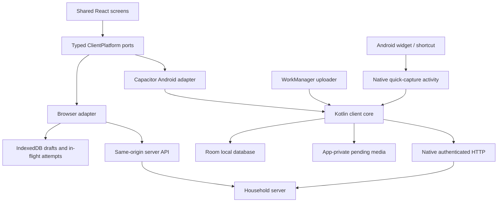

# Household app — stack selection and implementation boundaries

Date: 2026-09-26. Status: **working recommendation for the next implementation slice**, under the user's instruction to advance planning autonomously. This is a reasoned selection, not a tested application or a claim that the actual phones/host are configured. Framework documentation was checked against primary sources on this date; pin compatible versions when scaffolding.

## 1. Recommended arrangement

| Layer | Working choice | Responsibility |
| --- | --- | --- |
| Shared feature screens | React + TypeScript, built with Vite | Responsive desktop/tablet/phone layouts, forms, lists, boards and recipe browsing. |
| Android package | Capacitor with bundled web assets | Hosts shared screens and a narrow typed bridge to native capabilities; it does not need to load its UI from the home server. |
| Android persistence/capture | Kotlin + Room, app-private media files, WorkManager | Authoritative phone drafts, frozen submissions, authorised cache, upload recovery, camera/voice entry and later widgets. Works without a live web view. |
| Server | TypeScript + Fastify on Node.js 24 LTS | Typed application handlers, access checks, queries and one shared write coordinator. |
| Host persistence | SQLite through `better-sqlite3`; explicit SQL migrations/repositories | Existing relational model, short synchronous write transactions, history and receipts. |
| Host media and jobs | Ordinary files plus database-backed work in the server process | Publish/collect bytes safely; run external work outside database transactions. |
| Contracts | App-owned JSON Schema definitions using TypeBox; derived TS types and OpenAPI | Shared wire vocabulary, runtime validation and a bounded Kotlin contract-generation/fixture gate. No shared mutable ORM entities. |
| Deployment | One application image, dedicated data volume and backup-output mount, private HTTPS endpoint | Same server runs directly for development and in Docker. Windows target: local Linux-backed live volume, app-created online exports to a Windows folder, external system backup for remote protection; see [deployment plan](WINDOWS_DEPLOYMENT.md). |

The purpose is to share the large set of ordinary household screens while keeping Android's durable state and system entry points native. TypeScript owns server rules and shared screen behaviour; Kotlin owns platform persistence and integration. This is more work than a web-only app, but less repeated feature UI than two complete clients in my assessment. That maintenance comparison is an inference from this app's requirements, not a published benchmark.

Node lists version 24 as LTS and version 26 as Current at review time; choose the supported LTS line and pin its patch release at build time. Vite supports a React/TypeScript project without adding a server-rendering framework. [Node releases](https://nodejs.org/en/about/previous-releases), [Vite guide](https://vite.dev/guide/)

## 2. Client alternatives considered

| Arrangement | Strength for this app | Cost / why not the first choice |
| --- | --- | --- |
| **React + Capacitor + native persistence/capture** | One main UI codebase; desktop editing uses browser controls; native workers/widgets share one local store. | Bridge and lifecycle recovery need an early test. A thin wrapper that leaves the queue in JavaScript would not meet our contract. |
| Native Kotlin/Compose Android + React web | Direct Android integration and an idiomatic phone UI. | Most feature screens and interactions are implemented twice. This is the fallback if the hybrid interaction/lifecycle gate fails. |
| Flutter for Android and web | Substantial UI sharing and a coherent application UI framework. | Still needs native integration for system entry points and a carefully owned local queue; Dart adds a major language if the backend remains TypeScript. A credible alternative, especially if shared custom-rendered UI becomes the priority. |
| React Native + a web client | Native mobile UI and TypeScript reuse for contracts/policies. | Android system integration still needs native modules. Sharing React knowledge is useful, but does not by itself make desktop DOM screens and native mobile screens identical. |
| Browser/PWA only | Smallest platform-specific code surface. | Browser storage/lifecycle is a weaker foundation for the intended durable phone queue and native capture/widget interactions. Keep a browser client, but do not make it the only phone surface. |

Capacitor explicitly supports local plugins/custom Android code. That establishes the bridge capability, not the correctness of our proposed queue. Its App documentation also describes restored external-activity results after Android kills the originating app, directly relevant to camera recovery. [Custom Android code](https://capacitorjs.com/docs/android/custom-code), [plugin model](https://capacitorjs.com/docs/plugins/creating-plugins), [restored activity results](https://capacitorjs.com/docs/apis/app#addlistenerapprestoredresult-)

Flutter describes web support as suitable for app-centric experiences and documents native platform channels; it is not dismissed on an irrelevant SEO criterion for this private app. React Native likewise exposes native platform integration. These remain feasible alternatives, rather than capabilities declared impossible. [Flutter web FAQ](https://docs.flutter.dev/platform-integration/web/faq), [Flutter platform channels](https://docs.flutter.dev/platform-integration/platform-channels), [React Native platform APIs](https://reactnative.dev/docs/native-platform)

## 3. The native boundary is concrete

Only the Kotlin client core opens the Android application database. Do not add a second SQLite plugin that lets web JavaScript independently migrate/write the same file. The web screen, quick-capture activity and background worker call the same native draft/submission APIs. Avoid a separate Android process initially.

Room provides SQLite entities/DAOs and database ownership; WorkManager supports persistent work across app exit/restart and is appropriate for draining a durable queue. Neither guarantees immediate execution or successful contact with a sleeping/unreachable home server. The database queue remains authoritative; a scheduled work request is only a wake-up mechanism. Reconcile pending work on app start/resume as well as scheduling it after commits. [Room](https://developer.android.com/training/data-storage/room), [persistent work](https://developer.android.com/develop/background-work/background-tasks/persistent), [offline queue guidance](https://developer.android.com/topic/architecture/data-layer/offline-first#workmanager)

Proposed bridge capabilities:

| Port | Methods / ownership |
| --- | --- |
| `DraftPort` | Save/load/discard versioned form fields with local revision checks; native quick capture uses the same capture representation. |
| `CapturePort` | Request submission, freeze once, list pending state, resolve outcomes, create a corrected draft after terminal rejection. |
| `MediaAcquisitionPort` | Start camera/gallery acquisition with a persisted request ID; return durable media identities/readiness, not fragile temporary gallery paths. |
| `QueryPort` | Fetch/refresh authorised projections; read cached data offline. Native widgets use bounded queries from this same store. |
| `CommandPort` | Execute allowed online commands and persist their in-flight identity until resolved. This does not create a general offline-edit queue. |
| `VoiceCapturePort` | Launch a native restricted capture activity and return saved/pending state. Recognition/readback can run without loading the full web UI. |
| `PlatformCapabilities` | Report available camera, voice, permissions, native widget support and storage information, so screens adapt deliberately. |

These are a few typed capabilities, not a public generic SQL bridge or hundreds of table methods. Generic form fields and cache payloads can be versioned JSON inside the native store; shared domain rules remain on the server. Native code must understand the small capture/submission state machine and data needed for its system entry points, not reimplement every household feature.

The widget launches capture; it does not continuously record from a background worker. Glance has its own widget composables and is not directly interchangeable with normal Compose UI. Speech recognition availability, early-stop behaviour, permission flow, readback and lock-screen/button access remain device tests. Use final recognised text, preserve it before submission, and read back whether it is pending or synced. [Glance](https://developer.android.com/develop/ui/compose/glance), [SpeechRecognizer](https://developer.android.com/reference/android/speech/SpeechRecognizer)

### Browser adapter

Use IndexedDB for recoverable drafts, acquired Blob data and exact in-flight requests; use ordinary authenticated HTTP while open. Browser storage has quotas and eviction policies, so it cannot silently inherit the same storage guarantee as Android app-private pending media. Request persistent storage when supported and expose save failures. Do not promise uploads while all browser tabs are closed. The explicitly required dependable offline shopping/capture experience is delivered by the Android app. [Browser storage policies](https://developer.mozilla.org/en-US/docs/Web/API/Storage_API/Storage_quotas_and_eviction_criteria)

The UI reuses contracts and presentation logic across adapters. Each adapter has a small conformance suite for draft revisions, freeze/retry identity and cache ordering. Reusing one screen does not imply browser and Android persistence must use the same engine or background scheduler.

## 4. Server alternatives and selection

| Server | Fit | Decision |
| --- | --- | --- |
| **TypeScript + Fastify** | Reuses wire types/tooling with the main UI; explicit route validation and small handler composition suit the proposed coordinator. | Working selection. Keep TypeScript strict and validate runtime boundaries. |
| Kotlin + Ktor | Strong domain/value types; could share some DTOs with native Android. | Good fallback if most client logic/UI moves to Kotlin. Less benefit while the bulk of UI remains TypeScript. |
| C# + ASP.NET Core | Typed application code, OpenAPI and SQLite transaction support. | Technically suitable; introduces a third main language here without a demonstrated requirement. |

Fastify documents JSON Schema validation/serialization and TypeBox type providers. Ktor supports OpenAPI specifications; Microsoft's SQLite provider supports transactions. The selection is about this repository's maintenance surface, not an unsupported claim that another runtime cannot implement the model. [Fastify validation](https://fastify.dev/docs/latest/Reference/Validation-and-Serialization/), [type providers](https://fastify.dev/docs/latest/Reference/Type-Providers/), [Ktor OpenAPI](https://ktor.io/docs/server-openapi.html), [Microsoft SQLite transactions](https://learn.microsoft.com/en-us/dotnet/standard/data/sqlite/transactions)

### SQLite and transaction execution

Use prepared SQL in feature-owned repositories and numbered, checksum-tracked SQL migrations. Do not introduce an ORM unit of work that can flush outside the action coordinator, derive migrations from UI entities, or hide the cross-feature transaction. This leaves the model's composite keys, partial indexes and logical deltas visible.

`better-sqlite3` is a candidate driver with synchronous transactions and a backup API. Its transaction callbacks do not support `async` functions; mixing manual transaction control with its transaction wrapper is unsupported. Select **manual transaction/savepoint control in one adapter**, with a synchronous content handler and no `await` inside the write phase. Authentication, file preparation, hashing large files, import fetches and provider calls occur outside that phase. If SQLite aborts the transaction, do not continue issuing a supposed terminal-rejection write on an assumed live transaction. [Driver API](https://github.com/WiseLibs/better-sqlite3/blob/master/docs/api.md)

Start with one server process and one write connection, bounded read queries and short actions. Synchronous SQL blocks that process while it executes; this is an accepted first-slice tradeoff for two users, not a measured latency result. Bound text/media batches and measure realistic history/page queries. CPU-heavy image work belongs outside the event loop, using a worker/thread or subprocess if required; no second service/database is needed initially.

Use foreign keys on every connection, a bounded busy policy and explicit durability configuration. WAL is the working journal choice on a suitable local filesystem, with `synchronous=FULL` proposed for acknowledged durable writes. Do not place the live WAL database on an arbitrary network share: SQLite documents the same-host/shared-memory requirement. The Windows reference target uses a local Linux-backed Docker volume; verify the actual backend and disk placement during installation. [SQLite WAL](https://www.sqlite.org/wal.html)

## 5. Wire schema, validation and request identity

Keep TypeBox/JSON Schema definitions in an independent contract package. Derive TypeScript types and OpenAPI from those definitions, then generate or mechanically verify the limited Kotlin DTOs used by the client core. Exercise tagged unions, optional versus null, date-only values, integer bounds and unknown outcome values before committing to a generator. If a generator cannot express the small contract faithfully, hand-write that small adapter with shared JSON fixtures rather than distorting the public model.

Domain IDs remain strings. Dates/instants use explicit wire forms and map to the existing database representation; revisions and byte lengths are bounded to exactly representable wire integers. Do not send arbitrary 64-bit database integers as JavaScript numbers without a range or string encoding rule.

The server computes the semantic idempotency digest from a versioned canonical request representation. The phone persists the exact frozen request bytes/arguments for replay; its local byte-integrity hash need not equal the server's canonical request digest. Store the returned server digest with the final receipt. This avoids requiring two independently implemented canonicalisers merely to upload a capture. Media content hashes still match end to end.

There is an important validation split:

1. Reject unparseable, oversized or unauthenticated traffic at the transport boundary; it is not a final application outcome.
2. For a valid operation envelope and authenticated client, route a typed-argument validation failure through receipt arbitration so it becomes a durable `Rejected` result. Do not let a framework's automatic 400 response strand the immutable client queue.
3. Domain/access/revision checks remain in the application transaction. Malformed raw JSON without a valid operation identity cannot participate in this receipt contract; the client validates its envelope before freezing.

Fastify supports attaching validation errors to requests for handler processing; choose that facility or common-envelope validation plus explicit typed decoding. Disable mutation-producing coercion/default insertion/unknown-field stripping for command arguments so hashing and execution see the same defined request. Generated API documentation must still describe the full typed arguments, not merely an arbitrary JSON object. [Fastify route validation control](https://fastify.dev/docs/latest/Reference/Routes/#routes-options)

## 6. Development, synchronisation and upgrades

Use a TypeScript workspace with a single lockfile, plus the Android Gradle project. React and server tests run directly; Android uses emulator/device tooling. Build the production React assets into both the server's static asset bundle and the Android APK. Bundle code locally in the APK, and open untrusted recipe links externally rather than navigating privileged app content to arbitrary sites.

Serve web and API from one production origin. Native HTTP uses a configured HTTPS server address; native credentials stay in the native credential store and are not returned to JavaScript. Browser sessions use protected cookies with origin/CSRF controls. Tailscale is the proposed network access layer, not a substitute for the app's two identities/private scopes. Tailscale Serve can expose a service privately inside a tailnet; endpoint/proxy wiring on the proposed Windows host is an installation task. [Tailscale Serve](https://tailscale.com/docs/features/tailscale-serve)

Plan foreground invalidations after committed permitted changes, followed by authoritative refetch, plus refresh on resume and periodic repair while visible. An SSE connection is a reasonable first implementation; its signals carry no hidden private records or counts. A dropped signal is repaired by refetch, not treated as a lost mutation. Background widget freshness is best effort and displays last refresh time. Selective reminder delivery is a separate feature; WorkManager is not a promise of exact alarm/push timing.

Server, web and Android versions can differ during upgrades. Include supported contract versions in a capability query, preserve supported old submission decoders/receipt lookup while queued work exists, and never rewrite an old frozen request to a new shape on retry. Keep the Android application ID/signing key stable so later installs can update the app and retain local data. Distribution/signing-secret setup is an implementation task; no store upload is required for the first household trial.

## 7. Proof gates and fallback

Before building the full feature UI, the first slice must demonstrate:

1. A native capture and a React form produce the same durable local capture shape; both remain readable after the web view/app process disappears.
2. Native uploader can resolve that submission without loading React; lost acknowledgement creates one server record.
3. Camera activity/process recreation leaves either recovered bytes or an explicit incomplete acquisition, not a false saved attachment.
4. Text entry, keyboard resizing, scrolling, gallery selection and screen-reader labels feel usable on the actual phones and desktop.
5. Cross-language fixtures preserve command types, null/date semantics and frozen retry identity.

Failure of a platform requirement changes the implementation choice before many screens exist. If native persistence works but web-view interaction is poor, retain the Kotlin core and server and replace the Android presentation with Compose. If bridge complexity expands into reimplementing most client features twice, reconsider native Android or Flutter rather than continually adding special cases.

The read-only environment check found Node, pnpm, Java, adb and Docker command locations. It did not prove compatible versions, a usable Android SDK, a running daemon or device connectivity. The default SDK path could not be inspected in this session. No dependencies were installed, no device was accessed, and no service was launched for this recommendation.

The [first-slice implementation plan](IMPLEMENTATION_PLAN.md) turns these choices into a bounded build sequence and acceptance checks. The user has supplied the expected Windows/Docker, local-NVMe and main-PC backup arrangement; [WINDOWS_DEPLOYMENT.md](WINDOWS_DEPLOYMENT.md) resolves the working storage/backup design. Exact host settings and device behaviour remain installation/implementation checks, not established capabilities of the actual machines.
