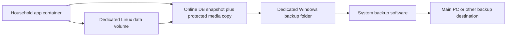

# Household app — Windows deployment and backups

Date: 2026-09-26. Status: image and Compose template implemented; isolated local Docker replacement/restore rehearsal passed. This is not an installation on the household host. See [README.md](README.md) for current commands. The user expects a Windows machine already running Jellyfin/Seerr/arr applications, with local NVMe storage (probably the boot drive). Online exports into a dedicated Windows folder plus remote protection supplied by the host's backup system remain the intended arrangement. The actual remote host, filesystem bridge, HTTPS route and backup system have not been inspected. These choices refine [A13](decisions/0003-file-media-and-container-storage.md).

## 1. Recommended storage arrangement

Run the Linux application image with a dedicated **Docker named volume** containing the complete `/data` tree. Keep Docker's Linux data disk on the intended local NVMe. Give the app a separate, dedicated `/backups` output mount backed by an ordinary Windows folder. The host's backup system can then protect completed exports on the main PC or another destination. No NAS or app-specific remote transport is required.

The files remain ordinary SQLite and media files. A named volume changes how their directory is mounted and managed; it does not put media inside SQLite or inside the replaceable application image. Docker documents volume persistence across container removal and the tradeoff that direct host access is less convenient. [Docker volumes](https://docs.docker.com/engine/storage/volumes/)

This refines the earlier illustrative host-directory bind mount for the Windows target. Docker recommends Linux-filesystem storage for Linux-container bind mounts on WSL2 and documents lower performance when crossing into the Windows filesystem. Keeping live storage inside the Linux environment also gives the Linux file-publication adapter a simpler boundary to validate. This is an engineering choice, not evidence that an NTFS bind mount necessarily corrupts SQLite. [Docker WSL2 storage guidance](https://docs.docker.com/desktop/features/wsl/best-practices/)

| Candidate | Fit for this app |
| --- | --- |
| **Dedicated local named volume** | Recommended for live data. One persistent root, no extra user-managed Linux distribution. App-created online exports provide ordinary Windows-accessible backup copies. |
| Directory inside a user-managed WSL Linux filesystem | Reasonable alternative if direct directory access matters. Preserves a conventional bind mount, but adds that distribution and its storage lifecycle to operations. |
| Windows directory bound directly into the Linux container | Convenient in Explorer. Requires validating the actual filesystem bridge, locking and durable file publication; not the reference target for the live database. Suitable for completed backup exports. |
| Remote share for live SQLite | Excluded from the reference target. The remote PC receives backup archives; it does not serve the live database. SQLite WAL requires same-host shared memory. [SQLite WAL](https://www.sqlite.org/wal.html) |

Use the existing Docker backend if it supports the required Linux containers; verify it before installation. WSL2 is the reference environment, not a reason to reconfigure working media services. Docker Desktop can run its WSL2 backend without a separately installed Ubuntu distribution, and its Linux data location is configurable. Verify that location rather than assuming the volume lands on the intended physical drive. [Docker WSL2 backend](https://docs.docker.com/desktop/features/wsl/)

## 2. Concrete boundaries

Names and paths below are proposed, not allocated:

```text
Windows host / local NVMe
  Docker Linux storage
    named volume: household-data
      /data/db/household.sqlite          + SQLite companion files
      /data/media/objects/               immutable originals
      /data/media/derived/               replaceable thumbnails
      /data/media/staging/               durable upload work
      /data/backup-work/                 disposable SQLite snapshot work

  C:\Household\ops\                      configuration and host scripts
  C:\Household\backups\                  app's /backups mount; finished exports
  C:\Household\backup-status\            optional status from host backup tool

Main PC / separate disk
  <managed by system backup>             independent retention/recovery
```



Keep one service in a separate Compose project. Mount its data volume and dedicated backup-output directory read/write, required configuration read-only, and explicit temporary storage. The app has no Docker socket or unrelated media-library/backup-repository mounts. In the recommended local-export arrangement it needs no remote backup credentials. Initialise ownership for the non-root runtime explicitly. Staging and final media stay on the same filesystem; no host-specific paths enter domain records. This deliberately revises the earlier rule that all backup storage was inaccessible for app writes: the app owns local exports; independent retained copies remain under the external backup system's control.

Provision the named volume explicitly and reference it as an external Compose volume with a stable name. Normal container replacement must preserve it. Compose documents that external volumes are not removed by `down`; this is lifecycle separation, not protection against every Docker administration command. Production startup requires the expected installation identity, and creating a new empty installation is an explicit bootstrap action, so a misspelled mount cannot silently look like successful recovery. [Compose down](https://docs.docker.com/reference/cli/docker/compose/down/)

Use the selected SQLite WAL/FULL durability settings and the [A13 publication/collection protocol](decisions/0003-file-media-and-container-storage.md). An NVMe and a volume are not a substitute for flushing files/directories before committing a live reference. Exercise those operations on the actual Linux container filesystem before real use.

## 3. Backup procedure

Routine backups keep the app usable. Scheduling off-peak reduces interference, but absence of human activity is not a correctness condition: uploads, reminders, imports and cleanup may still run. SQLite supports a consistent online database backup; that snapshot must then be paired with the immutable files it references. [SQLite online backup](https://www.sqlite.org/backup.html)

Use one bounded `BackupCoordinator` in the existing worker, with a `MediaRetentionGate` shared by every physical media-deletion path. A coarse hold on collection is sufficient for two users; no per-file pin table or separate backup service is required initially. Database snapshot work uses the driver's online backup facility outside content transactions. Incremental work may briefly contend with ordinary queries/writes; it does not promise zero latency impact. [Driver backup API](https://github.com/WiseLibs/better-sqlite3/blob/master/docs/api.md#backupdestination-options---promise)

1. **Prepare.** Serialise backup runs against upgrades/restores, allocate a run ID, check free space and confirm the configured output mount is the expected destination. A missing network mount must not silently become container-local output. Track work through existing operational jobs; no household content changeset is created.
2. **Protect bytes before the snapshot.** Acquire the collection hold, block new deletion claims and wait for already-started physical deletions to finish. Include space-pressure deletion and any cache path that can remove required originals. New records/uploads, edits and logical deletions remain allowed. Immutable objects must never be overwritten in place.
3. **Snapshot SQLite.** Create a fresh consistent backup DB in `/data/backup-work/<run-id>/` on the Linux filesystem using the online backup API. Await successful completion and close the output cleanly. Do not raw-copy the live SQLite file or separately sample its WAL. Record the snapshot's actual identity/epoch/schema from the copied DB; do not assume the snapshot represents the moment the job first started.
4. **Derive the manifest from that copy.** Enumerate all ready original-media objects in the copied database, with exact physical keys/generations, lengths and hashes. This includes live references and ready originals still in their retention grace period. Read the copied database, not current live rows. Omit rebuildable thumbnails, partial upload bytes and backup scratch files; record these exclusions explicitly.
5. **Copy and verify.** Package the snapshot DB and listed immutable files into a unique partial archive under `/backups`. Verify database integrity/foreign keys and each listed file's bytes; validate that all live attachments required by the snapshot are covered. A concurrent edit may replace a reference, but collection cannot remove the old bytes until this copy is complete. Any missing/mismatched required file fails the run rather than producing a nominal success.
6. **Publish a complete export.** Close/flush and verify the finished archive, then publish it with a final name and a completion manifest/checksum written last. Readers and external backup integration only accept completed exports whose manifest/hash matches. Use atomic rename on the same output filesystem where supported; validate this on the chosen mount. Release the collection hold once the required files are safely copied and verified; it never waits for remote system backup.
7. **Hand off.** The host's normal backup software protects the completed folder using its own destination, versioning and verification. It may use VSS to capture those finished exports. Exclude partial work where supported; otherwise the restore tool must ignore incomplete exports. Keep old complete exports long enough for the external backup schedule to collect them.

On cancellation, error or timeout, stop the snapshot/copy work before releasing the hold; mark partial output unusable. On process restart, abandon unfinished runs before enabling collection and never resume an old manifest without reacquiring protection and taking a fresh snapshot. A coarse in-process gate works because the initial architecture has one process owning all media mutation; a separate collector would require a shared durable coordination mechanism. Bound backup duration/space so failed output cannot suspend collection indefinitely.

Restore reconciles copied operational state before workers start: interrupted backup runs are abandoned, staging uploads whose bytes were intentionally omitted become retryable/incomplete, and derived images regenerate. Ready originals in the manifest must exist. This recovery is separate from committed records/history/receipts, which remain intact at the snapshot point. The existing upload protocol must allow the client to republish missing staged bytes after the restore-epoch reconciliation.

### Windows snapshots and the cold-copy fallback

VSS can take a point-in-time volume snapshot. Without application-writer participation, Microsoft describes the result as crash-consistent; that can be sufficient for a correctly implemented crash-recoverable database and file protocol. It is not automatically application-aware, and an idle UI alone does not establish consistency. [Microsoft VSS behaviour](https://learn.microsoft.com/en-us/windows/win32/vss/backups-without-writer-participation)

Our live named volume is inside Docker's Linux virtual disk. We have not established that the chosen Windows backup product coordinates guest flushing/snapshotting with this Docker backend. A host snapshot of the VHDX therefore needs a tested restore contract before becoming the app's backup strategy; it is not categorically impossible. Docker's documented direct VM-disk copy procedure requires Desktop stopped. App-created exports avoid relying on that unspecified integration. [Docker Desktop backup documentation](https://docs.docker.com/desktop/settings-and-maintenance/backup-and-restore/)

A stopped-app copy of the complete volume remains a valid manual fallback or upgrade procedure. It must include SQLite companion files and media together, with no remaining file mutators, and it stops only this app. Routine scheduled backup does not require that pause.

## 4. Retention, configuration and status

Working defaults for the household trial: daily off-peak exports, a verified snapshot before a schema upgrade, and seven daily plus four weekly local restore points if capacity permits. Remote retention belongs to the system backup policy. Configure local retention/space from observed archive size and the external backup schedule. Photo deletion's roughly 24-hour live-media grace period does not delete that photo from retained backup archives.

Keep the output directory bounded and preserve the latest verified copy if a new export fails. Insufficient space or an unavailable destination records a backup error while normal app use continues. A local export on the boot drive is useful for undoing application damage but does not survive that drive's loss. Protection against disk failure depends on the system backup actually copying completed exports elsewhere; its schedule can add delay beyond the app's daily snapshot schedule. Do not claim a fixed one-day recovery point without that evidence.

Back up the deployment configuration and the recovery material it needs as well as `/data`. Keep secret values in a protected backup bundle, separate from logs/manifests and source control; test that restored sessions/encryption material can be recovered or deliberately re-paired. Keep the Android release signing key separately recoverable so updates can preserve installed app data. Backup archives contain private records, so limit access to the backup operators and do not expose archives through ordinary household media routes.

Settings > Storage can show app database files (including WAL), original media, derived/staging bytes and timestamped totals. These are this app's files, not the size of Docker's shared virtual disk. Host free space and Docker storage capacity are different measurements and should be labelled separately if supplied.

Settings > Backups shows each completed export's timestamp, byte size, last integrity verification, last checked availability and latest run/error. The app can inspect its own output mount and reconcile completed manifests with its small operational catalogue. A past successful write is not proof that the file still exists; status samples are timestamped. No access to the entire system backup repository is needed.

Remote backup status is optional and separate. If the system backup tool supplies a small host-owned status report, mount only that report's directory read-only and display its reported destination, time and verification level. Without this integration, say **external backup status not reported**. A read-only mount of full archives is only needed if we deliberately offer archive browsing/restoration from that destination, not for size/status reporting. Administrative access governs backup details because archives include private records.

| Destination arrangement | Ownership / tradeoff |
| --- | --- |
| **App writes local Windows folder; system backs it up** | Recommended simplest boundary. App handles application consistency/status; existing backup software handles remote transport, credentials and retention. |
| App writes a dedicated network-share output mount | Feasible alternative after actual Docker/SMB permissions, availability and publish semantics are tested. Keep the SQLite snapshot on local Linux storage and stream finished artifacts to the share. A destination outage fails only that backup; the app releases the hold after aborting. Avoid assuming a mapped Windows drive is automatically visible to Docker. |
| External tool creates app backups | Can be supported via the same controlled export operation. App only needs metadata/status access for display, not broad archive access. |

The app can write/delete its local output, or its dedicated share folder when that option is selected. Independent remote retention/snapshots should be owned by the external backup system if protection from app-side deletion is desired. This is a deliberate permission boundary, not an assertion that a second writable mount is an independent safety copy.

## 5. Startup, upgrades and restore

Use a container restart policy such as `unless-stopped`, plus a readiness check that requires database startup/migrations and the file store to be usable. Container restart policy only works once Docker is running. Docker Desktop documents startup **at sign-in**; test the existing machine's behaviour after an unattended Windows reboot rather than promising boot-time service availability. Reuse the host's working startup arrangement where possible. [Restart policies](https://docs.docker.com/engine/containers/start-containers-automatically/), [Desktop startup settings](https://docs.docker.com/desktop/settings-and-maintenance/settings/#general)

Keep app access behind private HTTPS with application identities, as in [the stack plan](STACK_SELECTION.md#6-development-synchronisation-and-upgrades). The exact host endpoint, Tailscale/proxy wiring, port and backup credentials are installation values. No public port or change to existing services is needed to finish the architecture.

For upgrades, prefetch the pinned image and hold application writes through the verified pre-migration snapshot and migration, so no intervening writes fall outside that snapshot. A short maintenance mode or stopped-app copy is appropriate here; this is different from routine daily backup. Record upgrade intent durably and inspect migration state before choosing an image to resume after failure. Do not run two app instances against the production volume. An old image may not understand a migrated database: rollback that requires restoring old data uses the full recovery procedure, not just an image-tag change.

For restore, use a **new isolated named volume**, verify the archive and its application/schema compatibility, and perform the [recovery-epoch procedure](RESTORE_RECONCILIATION.md#5-operator-procedure) before admitting production commands. Never extract over the current live volume. A rehearsal has no household clients or external-effect integrations attached; a real cutover stops the old authority and switches the configured volume explicitly. Keep the original data/backup until recovery is verified. The epoch prevents stale queued work from being silently replayed into an older history.

## 6. Implementation gates

The host answer resolves the architectural dependency. Machine names, exact paths, transfer credentials and unattended startup can be filled in when installing; they do not block the first slice's local implementation or require more speculative architecture.

Before real household data becomes authoritative, demonstrate:

- Container replacement preserves text, photos and receipts on the selected volume.
- Actual publication/SQL recovery works after interruption; a missing/wrong mount fails clearly.
- Online backup survives concurrent edits, uploads and logical deletion, while physical GC cannot remove a required file before copying finishes.
- Backup failure/restart leaves partial work unusable, releases collection protection safely and keeps ordinary app use available.
- Completed-export publishing/retention works on the actual output mount; an unavailable destination does not falsely report success.
- System backup captures complete exports; absent remote status is shown as unknown rather than remotely verified.
- A separate restored container reads the copied database/history/photos and rejects old-epoch mutations as designed.
- Host reboot/startup and the bounded spool/retention policy work without administering the other media applications.

These are planned checks. No Docker host, scheduled task, backup connection or application runtime was changed by this design pass. Implement the bounded [first slice](IMPLEMENTATION_PLAN.md) before adding broader features; this host choice requires an operations adapter, not a different schema or client architecture.
