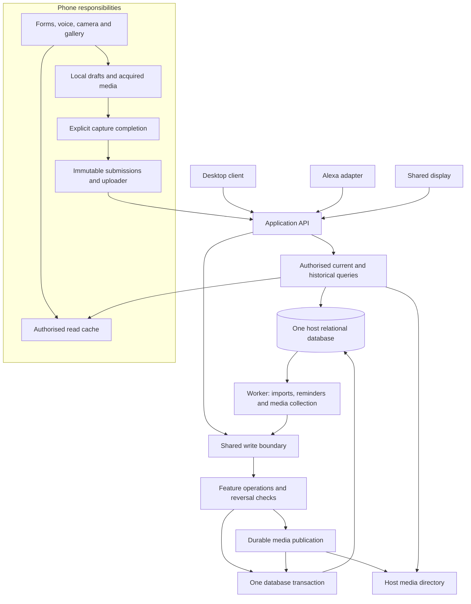

# Household app — architecture, iteration 4

Date: 2026-09-26. Status: architecture plan with a working stack recommendation and a bounded first implementation sequence. The user has authorised continued autonomous planning; choices remain revisable against the stated proof gates. Shared React/TypeScript screens, Capacitor with a Kotlin/Room client core, and a TypeScript/Fastify/SQLite server are the current selection. The expected host is Windows with Docker, local NVMe and backups to the main PC; [WINDOWS_DEPLOYMENT.md](WINDOWS_DEPLOYMENT.md) refines the mount and backup design. No application has been scaffolded or deployed.

This iteration connects the [database model](DATA_MODEL.md), [worked transactions](WORKED_TRANSACTIONS.md), [application contracts](APPLICATION_CONTRACTS.md), [stack selection](STACK_SELECTION.md), [implementation sequence](IMPLEMENTATION_PLAN.md) and [restore reconciliation](RESTORE_RECONCILIATION.md). Product requirements remain in [PLANNING.md](PLANNING.md). Detailed [capture](decisions/0001-offline-capture-submission.md), [history/media](decisions/0002-record-history-and-media-retention.md), [file storage](decisions/0003-file-media-and-container-storage.md) and [voice](VOICE_INTEGRATION.md) references retain their specific scope. Architecture drafts [1](ARCHITECTURE_ITERATION_1.md), [2](ARCHITECTURE_ITERATION_2.md) and [3](ARCHITECTURE_ITERATION_3.md) are preserved.

Primary documentation supports the selected libraries' capabilities; it does not establish phone-specific behaviour or a tested deployment. The first slice must prove the native/web boundary, interrupted camera capture, retry semantics and restore on the actual host before broad feature construction.

## Review outcome

The deployment remains one modular application server, one host relational database, and a small database-backed worker. The recent requirements justify revising the internal boundaries: local form recovery, immutable submissions, current household records, and historical versions have different owners and lifetimes. Media acquisition and retention now need a shared capability used by every feature. A common write boundary must make history and retry behaviour consistent across those features.

| Area | Change in this iteration | Consequence |
| --- | --- | --- |
| Client state | Explicit draft, submission, cache, and draft-media responsibilities | Local autosave cannot accidentally publish an unfinished item; cache refresh/eviction cannot erase pending work. |
| Committed writes | One transaction boundary for domain changes, history, receipts, media links, and required jobs | A save is one attributed historical step; a retry returns its result without repeating it. |
| History and undo | Shared history storage/queries, with reversal checks owned by the affected feature | Read-only history remains broadly useful while recent personal undo stays conservative. |
| Media | Shared acquisition, durable local copies, host objects, references, provenance, and collection | Camera/gallery capture works across features; expired bytes do not invalidate record history. |
| References and privacy | Prefer a thin record-identity registry for schema review | Notes, pins, media, and history can refer to stable records; typed domain payload and access rules remain explicit. |
| Client selection | Evaluate real draft/camera/offline behaviour before choosing the framework | A responsive screen alone is insufficient evidence for the phone requirements. |
| Storage display | Add a timestamped query and client measurement adapter | Settings gains useful storage information without a metrics service. |
| Connected schema review | Typed payload FKs, source-owned relationships, separate task occurrences/completions, client-scoped receipts | Worked transactions support these proposals; subtype completeness, hierarchy cycles and cross-record inverse guards remain explicit application obligations. |
| Application contracts | Explicit final/pending outcomes and typed handlers under one transaction context | Terminal rejection safely enables a corrected new submission; no-op exceptions are command-specific; compound actions do not nest independently committing commands. |
| Working stack | React/Vite + Capacitor, Kotlin/Room/WorkManager, Fastify + SQLite | Shared feature UI with native-owned durable phone state and background entry points; direct development and one deployment image. |
| Restore boundary | Installation identity and recovery epoch | Restoring an old backup cannot silently accept stale commands using missing receipts or coincidentally matching old revisions. |

## 1. Design goals and method

The user explicitly wants carefully structured classes, modularity, reusability, naming symmetry, and an architecture that accommodates future features. Evaluate these through behaviour: a new capture entrance should reuse existing operations; a recipe import provider should be replaceable without rewriting recipe screens; a new view should not require duplicate household records.

Work in iterations. Each architectural decision should record the problem, constraints, alternatives, proposed choice, consequences, evidence still needed, and what would justify revisiting it. Distinguish proposed decisions from accepted ones. Detailed interfaces and schemas should follow agreed ownership and lifecycle rules.

Plan the parts whose assumptions spread widely before building: identity and visibility, record identities, time semantics, offline changes, attachment ownership, and durable background work. Concrete provider classes and visual layouts can change more locally when their contracts are clear.

The architecture should accommodate known variations without implementing every future feature now. Introduce reusable abstractions when their meaning is shared and demonstrate them against at least two actual workflows. A shared UI control, a shared domain policy, and a shared storage mechanism are different kinds of reuse.

## 2. Constraints that shape the design

| Product requirement | Architectural consequence |
| --- | --- |
| Two people, phones and computers, awkward existing sync | Define mutation acknowledgements, retries, concurrent edits, and offline scope before selecting a client data library. |
| Voice, widget, typed entry, pasted links | Several entry adapters should invoke the same application operations. An inbox is one destination, not a compulsory stop for every shopping entry. |
| Private gifts and personal work views | Authorisation must cover queries, linked records, files, cached views, activity, and external exports. Network access alone is insufficient to choose what a person can see. |
| Targets, deadlines, reviews, snoozes, actual completion | Separate these concepts in the model and use-case vocabulary. |
| Recipes, maintenance records, media-rich projects | Keep durable records and their attachments independent of the tasks or views that refer to them. |
| Home hosting with possible Tailscale access | Prefer a small operational footprint; specify behaviour when the home server is unreachable and how a full restore works. |
| External calendars, Alexa, optional LLM imports | Model external identifiers, failures, retries, and data ownership explicitly. Provider-specific code belongs behind narrow interfaces. |
| Visual browsing and configurable home screens | Share a design system and interaction rules; keep presentation projections separate from canonical record storage. |

Confirmed inputs: both phones are Android. Offline access uses read-only cached server data plus editable/deletable local inbox drafts, including acquired photos. Unfinished forms are recovered locally without automatically submitting them. The user accepts locking a capture before its first submission attempt, including uncertain acknowledgement; later edits require resolution and an online update. Shopping check-offs require connectivity. Temporary server unavailability is acceptable. Runtime/client choices now have a working recommendation. The user expects a Windows Docker host using local NVMe, with backups to the main PC; exact installation settings and acceptable backup recovery interval remain to be confirmed before real use.

## 3. Proposed deployment shape

The agreed storage direction is one host relational database for this two-person self-hosted application. Domain records, committed change history, submission receipts, job state, and media metadata/references all live there. Each phone likewise uses one local database for its cache and pending captures. SQLite is the working database choice; host media bytes are immutable ordinary files. For the expected Windows host, the working recommendation refines the earlier directory bind mount to a dedicated Linux-backed Docker named volume containing separate database and media subdirectories. The app creates online backups in a separate dedicated writable output mount backed by a Windows folder; the host's backup system protects completed exports remotely. Independent retained copies remain outside the app's write access. [A13](decisions/0003-file-media-and-container-storage.md) defines the file/SQL consistency and cleanup contract; [Windows deployment](WINDOWS_DEPLOYMENT.md) defines the host-specific boundaries.

Start with one application server whose feature modules have explicit boundaries. This is a modular monolith: modules are code boundaries within one application, not separately deployed services. A background worker can initially run within that application using database-backed jobs. The reliability target is durable data through restarts, request interruption, retries, and upgrades, plus tested backup/restore. The server may be temporarily unavailable; failover infrastructure is not a current requirement.

Docker is the deployment target, not a prerequisite for every development command. Keep one application entry point, configuration contract and schema migration path that work both directly and inside the image. Configure the data root instead of hard-coding container paths into domain code. Unit tests and most database/media tests run directly against isolated temporary directories and the same storage implementations. Add image/Compose packaging with the first runnable server slice and exercise startup, permissions, migration, media persistence across container replacement and restore before expanding features. Optional Compose Watch/source sync can support container-based development later; the ordinary edit/test loop need not build or launch Docker.

The benefit for this household is coordinated changes, transactions, deployment, and backups with a small number of moving parts. The cost is shared runtime resources and failure scope. Long-running imports must be isolated from request handling, and module boundaries need enforcement through package dependencies and tests. Splitting a worker or integration later is possible, but would still require a deliberate data and transaction migration; interfaces do not make that free.

This diagram shows responsibilities rather than settled network routes. Alexa's cloud-to-home bridge remains a separate feasibility test. Both phones are Android. The selected arrangement shares React feature screens in browser/Capacitor and gives Kotlin sole ownership of the Android queue, cache and media; native quick capture, widgets and WorkManager call that same core. The comparison and native-UI fallback are in [STACK_SELECTION.md](STACK_SELECTION.md).

Rationale reference: [Monolith First](https://martinfowler.com/bliki/MonolithFirst.html) discusses the difficulty of fixing service boundaries before the domain is understood. The deployment choice here is a recommendation for this app, not a requirement to use microservices later.

## 4. Proposed domain ownership

These are candidate feature packages, introduced as their features are built. They are not instructions to scaffold every package or class immediately.

| Module | Owns | Boundary to preserve |
| --- | --- | --- |
| Access | Household membership, person/device identity, capability and visibility decisions | A shared speaker or kitchen display is not implicitly a personal user with access to private gifts. |
| Inbox | Captured text/links/media, original input, capture provenance, filing state | Filing links to or creates a domain record while retaining capture provenance; it does not duplicate the record's ongoing state. |
| Tasks | Actionable work, recurrence rules, occurrences, actual completion and corrections | Recipes and home assets are references, not subclasses of a task. Reminding and completing are separate operations. |
| Shopping | Active shopping entries, reusable restock items, purchase history | Buying and installing/replacing are different events. A recurring need can reuse a restock item without reopening an old purchase record. |
| Recipes | Saved recipes, source versions, collections, household adjustments, cooking history | Imports never overwrite household adjustments; collection moves preserve recipe identity. |
| Maintenance | Home assets, maintenance plans, service records | Reuse task scheduling/completion through an explicit workflow rather than a second recurrence implementation. |
| Projects | Project/page hierarchy, reference content and links | A task can appear on a project without copying it or inheriting unintended visibility. |
| Gifts | Gift suggestions and private gift plans | Private purchase state remains distinct from a shared suggestion; shared activity never derives from unrestricted gift data. |
| Reminders | Reminder requests, per-person snoozes, channel preferences and delivery attempts | Task target dates and recurring schedules belong to Tasks; calendar ownership remains with its source. |
| Views | Personal layout preferences, scoped pins, dashboard/agenda/activity queries | Views reference canonical records. A unified display is not a universal domain object. |

Supporting capabilities include attachment storage, typed record references, clocks/time values, persistence, and external adapters. Each must have an owner and a small contract; a miscellaneous `Common` package should not become the path around boundaries.

### Shared capabilities with explicit ownership

These responsibilities can be small packages or ordinary types/functions within the application. They do not imply additional services, a plugin framework, or a class for every table.

| Capability | Owns | Boundary |
| --- | --- | --- |
| Client drafts | Recoverable form contents, local revisions, target/base revision, submission intent | The capture workflow reuses this storage; it must not maintain a second independently editable copy of the same text. |
| Client submissions | Frozen payload/media manifest, retry identity, delivery progress, acknowledgement | Only ready inbox captures enter the offline submission path. Other unfinished forms do not become queued server edits. |
| Client media | Acquisition results and durable local bytes referenced by drafts/submissions | Pending media is protected; cancellation and incomplete acquisition are distinct from a complete attachment. |
| Client read cache | Authorised downloaded records and disposable media copies | Refresh replaces cached state, never drafts or unacknowledged submission bytes. |
| Write coordination | Transaction scope, operation receipt handling, attribution, and required history/job participation | Feature modules retain business rules; the coordinator does not switch on every entity type or invent generic mutations. |
| History | Ordered change sets, authorised version reconstruction and history queries | Undo asks the owning feature to check reversal; history does not blindly apply arbitrary row inverses. |
| Media | Host media identity/bytes, attachment links, source provenance, live-reference checks, collection | Record owners decide what may be attached; Access decides who may view it. Historical references do not retain bytes indefinitely. |
| Records — proposal | Stable identity, record kind, revision/deletion metadata and visibility-scope reference for cross-feature targets | Typed feature tables retain domain payload; Access owns permission policy. This is not a universal household-item superclass. |
| Storage information | Timestamped local/host size measurements | A query capability with cached results, not a background telemetry platform. |

Client and host media share concepts and wire contracts, but their lifecycles are different: a local photo awaiting upload is not an unreferenced old host blob eligible for 24-hour collection. Likewise, local typing undo, saved-action undo, and read-only historical navigation have separate implementation boundaries and user controls.

### Reference model after the connected schema review

Prefer a thin `records` registry for durable user-visible targets because history, attachments, pins, and project links now all need stable references across feature types and deletion. Start with identity, kind, a visibility-scope reference, revision, and deletion metadata; keep recipe/task/project payload in typed feature tables. Each metadata field has one authoritative owner rather than separately writable copies on both registry and payload rows.

The cost is an extra relation/join and explicit rules ensuring complete typed payloads. The connected model uses constant-kind composite foreign keys to prevent the wrong subtype, while the write coordinator checks that no registry row commits without its payload. Owned-child edits advance the parent revision once; inbound links and personal pins do not revise their targets. An ingredient or job has no automatic registry entry. Typed domain relationships, such as task-to-recipe links, retain typed FKs. Selected constraints have been exercised in an in-memory SQLite probe; this is not validation of a complete application schema.

One module cannot write another module's tables directly. Cross-feature workflows call module operations. Where atomicity is necessary, an application-level coordinator can enlist both operations in one database transaction. This makes the dependency and transaction visible and avoids circular calls between feature modules. Read composition uses authorised query contracts or explicitly owned projections; joins and foreign keys across feature tables are appropriate within the shared database. Code ownership must not force duplicate records or artificial database isolation. Design the complete relationship map and schema conventions together before feature-by-feature DDL.

An attachment is a stable placement on one parent record, with caption/order/role. Media objects own byte identity, provenance and storage lifecycle; upload records own transfer state. Access must be checked when bytes or thumbnails are served. Sharing private media creates an explicitly shared copy/object, not automatic permission widening. Typed references establish existence; read/write rules also detect deleted or inaccessible targets.

## 5. Classes, composition, and naming

Give domain classes responsibility for their own meaningful state transitions and invariants. Use value types for concepts such as a local date, a time zone, a quantity, or a recurrence rule. Use ordinary functions for stateless transformations. Use interfaces where a real boundary exists: persistence, a clock, a provider, or a policy with multiple meaningful implementations.

Suggested layering inside a feature:

- **Domain:** entities, value types, invariants, domain policies; independent of HTTP, UI, database mapping, and provider SDKs.
- **Application:** use cases, authorisation, transaction coordination, and interfaces needed by those use cases.
- **Adapters:** persistence implementations, API endpoints, import providers, and other external integrations.

Keep client presentation code separate. Shared wire contracts can be generated; they should not expose mutable server entities or require every client to use the backend language. The server remains the authority for business rules even when clients duplicate some validation for responsive feedback.

| Role | Naming convention | Examples |
| --- | --- | --- |
| Domain entity | Singular domain noun | `Recipe`, `ShoppingEntry`, `TaskOccurrence` |
| Typed identity | Entity name plus `Id` | `RecipeId`, `ShoppingEntryId`, `TaskOccurrenceId` |
| Use case/command | Explicit verb plus object | `SaveRecipeLink`, `CreateTask`, `CompleteTaskOccurrence`, `RescheduleTaskOccurrence` |
| Query | Read verb plus result/scope | `GetRecipe`, `ListRecipes`, `GetPersonalOverview` |
| Domain event | Completed fact in past tense | `RecipeSaved`, `TaskOccurrenceCompleted`, `ShoppingEntryPurchased` |
| Boundary interface | Domain capability | `RecipeExtractor`, `MediaStore`, `FormDraftStore`, `ReminderChannel` |
| Adapter | Specific implementation plus capability | `SchemaRecipeExtractor`, `LlmRecipeExtractor`, `FileMediaStore` |

These names are provisional but the symmetry is intentional. Pick one vocabulary and apply it across code, API contracts, tests, and documentation. Keep exceptions explicit: `Complete`, `Purchase`, `Cook`, `Snooze`, and `Reschedule` describe different facts and should not all become `SetDone`. Avoid vague `Manager`, `Helper`, or `Service` types when the responsibility has a concrete name.

For symmetric controls, use explicit operations such as `PinRecipe`/`UnpinRecipe` or a command that sets desired state. Replaying a `Toggle` after a network timeout can reverse the intended result. An undo is not always a literal inverse: correcting an actual completion may affect the next recurring occurrence, so it needs its own rule.

Prefer composition to a hierarchy such as `HouseholdItem -> Task -> RecipeTask`. Shared titles, notes, references, or pin controls do not make recipes, purchases, and tasks substitutable. Introduce a common abstraction only when its operations have the same meaning for every implementation.

Use symmetrical names where the operations are actually symmetrical: `SaveFormDraft`/`DiscardFormDraft`, `GetRecordHistory`/`GetRecordVersion`, `UndoAction`/`RedoAction`. `CaptureDraft` composes form content and acquired media; `CaptureSubmission` is the frozen transfer snapshot. `ChangeSet` describes a committed action. Avoid using `Session` for all three, or making each record entity responsible for uploading, history reconstruction, and widget rendering.

The contract pass proposes `RequestContext` for authenticated identity, `ActionContext` for one transaction and `WriteCoordinator` for receipt/finality/revision coordination. These are scoped responsibilities, not a class-per-command requirement. Feature repositories register owned changes under that context; provider calls run outside it. See the concrete interfaces in [APPLICATION_CONTRACTS.md](APPLICATION_CONTRACTS.md#10-module-interfaces-and-transaction-composition).

## 6. Data and lifecycle contracts under review

### Tasks and time

The connected model proposes `Task` for the definition and optional recurrence policy, `TaskOccurrence` for a particular actionable instance, and `TaskCompletion` for actual work and attribution. One-off tasks also receive an occurrence, keeping completion/assignment/date APIs uniform at the cost of one extra entity. Maintenance extends Tasks with an asset link and service records, rather than duplicating recurrence. Worked transactions cover simultaneous completion, backdated work and conservative correction/undo.

Represent deadlines, flexible targets, and review dates with explicit meaning; a record may need both a genuine deadline and an earlier reminder. Store completion instants separately from local dates and calendar times. Fixed schedules need a time zone and daylight-saving rules; completion-based recurrence needs a policy for corrected or backdated completion. A pin has ordering and personal/household scope, with no implicit due date.

A recurring occurrence needs a stable identity so simultaneous completion from two devices does not advance the schedule twice. Define reopen, skip, undo, schedule edit, and late completion behaviour before implementing recurrence. Keep one active missed occurrence by default, as proposed in the product plan.

### Shared edits and offline operations

Proposed first offline contract, based on the user's refinement:

| Data or operation | Offline behaviour |
| --- | --- |
| Previously synced recipes, projects, tasks, inbox, shopping | Browse an authorised cached copy; existing records are read-only. |
| New inbox capture on this phone | Save durably as a local draft with a stable identity; permit editing/deletion until it is frozen before first submission. |
| Shopping check-off, task completion, moving a recipe, editing/deleting an existing inbox entry | Requires connectivity under this proposal. Offline shopping means browsing the list. |
| Reconnection | Refresh cached records and submit pending captures; show which entries are still local, sending, accepted, or need attention. |

Cache the data the current person is permitted to read, rather than copying a raw production database containing other people's private gifts, integration secrets, or server-only job state. A local database can hold this read cache and a separate draft store. The local schema and engine need not match the server. Choose the initial cache coverage and attachment/download policy explicitly: thumbnails and selected recipe details are different storage commitments from every original photo and receipt. Show the last refresh time and distinguish uncached content from absent content.

Useful client responsibilities are `ReadCache`, `FormDraftStore`, `CaptureSubmissionStore`, `DraftMediaStore`, and `CaptureUploader`. A `CaptureDraft` is a local editable object using the shared form-draft persistence capability; a `CaptureSubmission` is frozen; an `InboxEntry` is an accepted server record. These can appear together in the inbox UI with distinct sync state, without treating the read cache as a writable replica. Refreshing the cache must never erase unsent drafts. Each draft belongs to its author/device context; changing signed-in person must not expose another person's cache or drafts.

Use local form-draft persistence for unfinished text/new items, separate from the shared record history and the editor's in-memory undo stack. A recovered existing-record editor retains its base revision and requires an online conditional save. Draft persistence alone never requests submission: the uploader only freezes captures explicitly marked ready by Save/Submit or the agreed capture-complete event. Preserve the latest draft before camera/gallery launch and deliberate navigation; surface persistence failures. Cross-device draft sync is not an initial requirement.

Camera, gallery, shared images, and desktop file/paste inputs feed the same attachment acquisition/staging capability. On Android, the system [Photo Picker](https://developer.android.com/training/data-storage/shared/photo-picker) supports selected-media access, and [TakePicture](https://developer.android.com/reference/androidx/activity/result/contract/ActivityResultContracts.TakePicture) is a candidate camera adapter. Stage durable app-owned bytes for deferred upload instead of depending solely on an external content URI. Keep acquisition state separate from completed attachments; cancellation or unavailable cloud content must not discard the form. Device/library integration remains unimplemented and requires testing.

The agreed handoff direction is `DRAFT -> SUBMITTED -> ACKNOWLEDGED`. In a short local transaction, freeze a ready capture's create payload and attachment manifest and mark it `SUBMITTED` before its first submission/upload request. Require all selected media to be durably available locally first. Local edits/deletes must check that the record is still `DRAFT`; frozen attachment bytes/identities follow the same rule. No database lock stays open across network I/O. A timeout or restart leaves the immutable submission available for retry rather than reopening local editing.

Use one stable operation ID and exactly the same create payload/media identities for retries. Proposed receipt key `(client_id, operation_id)` supports personal phones and shared integration callers; human attribution is nullable and authenticated. Durably publish media files before committing the inbox entry, media metadata/links, changeset, creation receipt and required work together in SQLite. A matching replay returns the original receipt without overwriting the entry. Changed payload under the same key is rejected. Retain receipts after editing, filing and deletion so late retries cannot resurrect records.

An online Edit first resolves the creation, obtains the current record/revision, then uses the ordinary online update contract. Connectivity alone does not prove whether creation happened. There is no post-submission local editing/cancellation queue under this decision. An uncertain submission remains read-only until resolved, an explicitly accepted interaction cost. Creation idempotency does not eliminate simultaneous online edits or the need for separate retry semantics on update/delete.

See [A04: Freeze inbox captures before submission](decisions/0001-offline-capture-submission.md) for transition/replay semantics and [DATA_MODEL.md](DATA_MODEL.md) for the proposed common receipt and client schemas.

For normal online edits, specify conflicts by operation: text edits can require an expected revision; independent new notes can coexist; delete versus edit needs a recoverable conflict. Domain uniqueness checks must also prevent two different commands from completing the same occurrence twice. A cache change feed needs ordering/cursors, deletion notices, and a full-refresh path. Permission changes remove now-inaccessible cached records on reconnect; already downloaded data cannot be retroactively made unseen.

HTTP conditional requests are one possible expression of expected revisions: [RFC 9110, If-Match](https://www.rfc-editor.org/rfc/rfc9110.html#section-13.1.1) describes preventing lost updates. The final protocol and retention of deduplication records remain decisions. Broader offline mutation support can be a later explicit feature without changing the domain record identities.

### Durable jobs, notifications, and integrations

Commit a record change and any required follow-up work in the same host database transaction. A worker then retries delivery/import separately. Give reminders, calendar exports, and import results stable identities and explicit states. Only acknowledge shared storage after commit; queued work is a distinct acknowledgement.

This is the transactional outbox principle. It prevents a committed change from losing its required follow-up because of a crash between two writes; it still requires duplicate handling at the receiver. [AWS transactional outbox guidance](https://docs.aws.amazon.com/prescriptive-guidance/latest/cloud-design-patterns/transactional-outbox.html)

Recheck reminder eligibility and current visibility before sending, since a task may have completed or become private after a job was scheduled. Define quiet periods and cancellation races when designing the delivery contract. External services may not support deduplication, so do not promise exactly-once notification delivery.

Keep external calendar event IDs and source ownership separate from tasks. Start with read-only work agenda aggregation and explicit household calendar operations; bidirectional edits need their own conflict policy. Recipe extraction returns an import draft, not unrestricted commands against household data.

### Persistence and recovery

All feature writes use one explicit application transaction boundary. This can be an ordinary function or unit-of-work wrapper; it does not require a command bus or a general event-sourcing framework. Its contract is:

1. Authenticate the caller and establish operation scope, person attribution if known, and request identity. Prepare/validate incoming bytes and external results outside the write transaction. For file media, durably publish complete objects under a publication claim before the transaction that creates their live references; failed finalisation leaves recoverable pending files.
2. Within the transaction, resolve an existing operation receipt before attempting a fresh mutation, checking the caller's access to that receipt. A matching retry returns its committed outcome; a changed request under that identity fails. Enforce uniqueness in the database. Receipt replay does not bypass current permissions for reading the resulting record or its history.
3. For a fresh action, check current authorisation, expected revisions, and relevant relationships. Invoke the owning module's operations, enlisting cross-feature work in the same transaction when required.
4. Persist the domain changes, media metadata/reference changes, one attributed ordered change set, receipt, and required jobs together. If any required database part fails, none of that transaction commits. Previously published files may remain pending/unreferenced for retry or cleanup; filesystem publication is not rolled back by SQL.
5. Acknowledge only after commit. Network fetches, LLM calls, notifications, and waiting for photo uploads are outside this transaction; subsequent durable results are separate attributed actions.

History capture is mandatory for tracked domain writes, including background imports and supported undo. Whether it is produced by typed application change recording or a SQLite capture adapter is still an implementation decision. The shared boundary must make bypasses detectable with representative contract tests; repository methods must not quietly commit independently. SQLite capture-session lifetime, if used, is one action, never one person's login.

Normal queries read current records. `GetRecordHistory` and `GetRecordVersion` reconstruct permitted historical content. `UndoAction` and `RedoAction` check the attributed person and delegate reversal validation to the owning module, then use this same write boundary. Historical reads and external delivery receipts never roll the live database backward. This preserves ordinary relational queries while keeping history as a first-class contract.

Use one transactional relational database for linked domain records and operational metadata, with `FileMediaStore` managing ordinary files under the app-owned mount. Staging, durable publication, database finalisation, and deferred unlink have explicit recoverable boundaries. A collection claim prevents concurrent reattachment while a file is being deleted; a later transaction records the tombstone. SQL rollback cannot restore an unlinked file. Review the SQLite library, host filesystem, Docker mount configuration, and coordinated backup procedure alongside the stack. No external object-storage service is required.

Propose current relational state plus append-only logical change sets, committed atomically with receipts and required jobs. Read-only history supports browsing and copying old content. Recent undo/redo targets the current person's actions, advances revisions, and rejects later conflicting row/dependency changes without merge dialogs. Media replacements change immutable object references; retain unreferenced bytes for roughly 24 hours, possibly less under storage pressure, then preserve historical metadata and source URIs where available. [A09: Record history and media retention](decisions/0002-record-history-and-media-retention.md) covers person attribution, reversal checks, visibility, and best-effort recovery from media sources.

Settings > Storage reports database storage on this device and the server, with media/file storage separately labelled, measurement times, explicit refresh and cached server results offline. A small adapter supplies sizes through the normal API. The [data model](DATA_MODEL.md#13-phone-database-and-offline-boundary) specifies timestamped samples; [A13](decisions/0003-file-media-and-container-storage.md) explains media accounting and filesystem versus internal database space. No live metrics infrastructure is required.

Design the whole known schema as one coherent model: common identity/attribution, naming, reference, visibility, time, revision, quantity, deletion, and migration conventions. Plan the relationships across all feature modules, then implement tables incrementally through one migration history. [DATA_MODEL.md](DATA_MODEL.md) contains the first inventory and the decisions to resolve before detailed DDL.

Plan schema migrations and client/API compatibility from the first build. Backups must include attachments and the database in a consistent recoverable set; perform a restore exercise. Define deletion/undo and retention so offline clients cannot silently resurrect deleted records. Export should preserve stable links between recipes, notes, tasks, media, and provenance.

## 7. Worked cross-feature example

### Offline receipt photo to shared inbox

1. A person types a caption and launches the camera. The client persists the unfinished form and acquisition context locally before switching away.
2. The acquired image becomes durable local media linked to the draft. Leaving the screen or restarting can recover the caption and photo; a cancelled camera result leaves the rest of the form intact.
3. Save/Submit requests submission. While offline, the complete capture remains locally recoverable. An unfinished autosaved form without this intent is not eligible for upload.
4. When uploading begins, one local transaction freezes the caption, attachment manifest, stable identities and request digest. The uploader retries the frozen submission after interruption; it does not reopen editing on timeout.
5. The server durably publishes the complete media files, then accepts the action through the shared write boundary: inbox record, media metadata/reference rows, one change set, receipt, and any jobs commit together. If the reply is lost, the same request resolves to that receipt. Bounded whole-request upload versus separate upload requests remains a transport decision; both require protected staging/publication and neither may acknowledge photos it has not retained.
6. The phone reconciles the acknowledgement with the local capture and cache. Only then can upload-protection on local bytes be released under the normal cache policy. No duplicate inbox card or duplicate history step appears.

This path exercises local persistence, the client framework, camera return behaviour, media ownership, transaction/history integration, and retry semantics before adding more features.

### Alternating note edits and personal undo

Four successive saves by user/wife/user/wife produce four ordered change sets and four inspectable committed versions. History reconstruction includes both people's changes; filtering the list by author does not change the reconstructed state. The user's attempted undo after the wife's later same-record edit fails conservatively with access to history/copy. An unrelated change to a shopping entry does not block it. A private old value remains private even if a later version of its record is shared.

### Recipe to shopping, task, and cooking record

1. A person pastes a recipe URL. `SaveRecipeLink` stores a recipe record and required import work atomically, then returns the recipe identity immediately.
2. Import work reads the source and uses a `RecipeExtractor`: structured metadata first, optional LLM extraction later. The result includes source information and missing fields. Applying it checks the current recipe/import revision and preserves newer manual edits and household notes.
3. `PinRecipe` marks it for Soon in the chosen personal or shared scope. The recipe remains in Want to try or Favourites.
4. `CreateTask` makes an actionable task linked to that recipe. It owns its target, occurrence, and optional reminder; no recipe is copied or converted into a task.
5. Selected ingredients create linked shopping entries through the Shopping module. Retrying the same operation cannot duplicate the additions; handling an independently requested duplicate is a separate user/domain decision.
6. Completion records actual cooking time and can produce a linked cooking-history entry. Replaying that occurrence's completion cannot create a second history entry. A permanent adjustment note is stored with the recipe independently of this particular attempt.

Run the same boundary check for a furnace filter: a home asset owns its service context, a restock item identifies a compatible replacement, shopping records buying it, and task completion records installation. Reuse scheduling and linking; preserve the different meanings of purchase and installation.

## 8. Presentation architecture

Use shared design tokens, responsive layout primitives, and consistent interactions: card/list presentation, explicit Save/Cancel, edit/delete/undo, date picker plus postponement presets, and Ctrl+Enter for the active form. Feature screens compose those parts while retaining their own domain language.

A configurable overview chooses registered section types, order, count, filters, and work/home scope. The first registry can be ordinary code plus versioned user preferences; it does not require a plugin system. Widget and display projections have their own audience and space constraints. Reuse permitted queries and formatting rules while preserving native interaction needs.

The working choice shares ordinary React screens, not Android system surfaces or every storage implementation. Kotlin implements native capture/widget entry points and owns Room/app-private media; the browser adapter uses IndexedDB and HTTP. The first capture slice must verify bridge/lifecycle behaviour on actual devices, with native Compose as the Android presentation fallback. The API boundary permits another client without changing canonical household records.

## 9. Decisions and their change costs

Recommendations remain proposed except where a row records a direction explicitly agreed in conversation. Agreement on direction does not imply that its detailed protocol or implementation has been validated.

| ID | Decision | Starting proposal | Consequence or alternative to examine |
| --- | --- | --- | --- |
| A01 | Deployment and module boundaries | One modular server plus durable worker | Small operational footprint, shared failure scope; separate services only when isolation or independent operation justifies their contracts. |
| A02 | Record model | Distinct domain records with typed links and composed capabilities | More explicit types, fewer ambiguous flags; a universal item model makes cross-feature rules and migrations harder to constrain. |
| A03 | Identity and privacy | Paired devices, person/household identity, server-enforced visibility | Some identity setup remains even on trusted LAN; private gifts and personalised views depend on it. |
| A04 | Offline ownership — agreed direction | Authorised read cache; local drafts freeze before first submission and retry idempotently until acknowledged | Avoids general offline merge; submitted captures stay read-only until resolution. See the linked decision for schema and protocol detail. |
| A05 | Client/platform stack — working selection | Shared React/TypeScript screens, Capacitor package, Kotlin/Room/WorkManager client core | Native-owned durable state survives absent web UI; early lifecycle/usability gate and native Compose fallback. See STACK_SELECTION.md. |
| A06 | Persistence — agreed direction | One host relational database for domain data and operational metadata; media bytes in files; one local database per phone | Whole-app schema design precedes feature DDL. SQLite is the working database choice. A13 supersedes the earlier host-BLOB preference; backup/restore must cover DB and files together. |
| A07 | Extension mechanism | Narrow provider interfaces and in-process use-case contracts | Replaceable integrations with ordinary code; avoid committing to a public plugin ABI before a need exists. |
| A08 | Side effects | Durable work records and retry-safe consumers | More explicit job states; avoids coupling save success to calendar, notification, or LLM availability. |
| A09 | Record history and media retention — goals agreed, mechanics proposed | Current records plus deltas for read-only history and recent personal undo; whole media replacement with deferred collection | Undo/redo rejects later conflicts and never targets the other person's action. Retain source URIs for possible recovery after bytes expire; a URL does not guarantee the original image. See the linked decision. |
| A10 | Local drafts and photo acquisition — requirements agreed, mechanics proposed | Recoverable local forms, explicit submission intent, shared camera/gallery attachment workflow | Device-local drafts are distinct from server records and immutable submissions; pending media cannot be evicted as cache. |
| A11 | Cross-feature target identity — proposed, reviewed in connected model | Thin record registry plus typed payloads/relationships | Composite kind FKs plus transactional payload-completeness checks; source-owned links and explicit visibility/deletion rules. See DATA_MODEL.md. |
| A12 | Common write contract — proposed | Shared transaction coordination for domain state, history, receipts, media links and jobs | Centralises consistency rules while domain modules own valid actions and undo dependencies. Capture implementation remains replaceable. |
| A13 | File media and Docker storage — direction agreed, Windows/backup refinement proposed | Immutable media files plus SQLite metadata; dedicated local Linux-backed Docker volume on the expected Windows/NVMe host | Publish files before committing live references; online SQLite backup plus protected media copy to a dedicated output mount, with remote retention owned by system backup. See the linked decision and WINDOWS_DEPLOYMENT.md. |
| A14 | Connected whole-app model — proposed | Client-scoped receipts, typed domain families, task occurrences/completions and owned relationships | md/DATA_MODEL.md and md/WORKED_TRANSACTIONS.md make the proposals reviewable before frameworks or production DDL; selected SQL guarantees checked separately. |
| A15 | Server/contract implementation — working selection | TypeScript/Fastify, TypeBox contracts, explicit SQL with better-sqlite3 | Synchronous bounded content actions under one coordinator; validation failures must still reach durable receipt arbitration. See STACK_SELECTION.md. |
| A16 | Restore discontinuity — proposed | Stable installation ID, changed recovery epoch on restore, explicit client reconciliation | Old snapshots can lose receipts and reuse earlier revisions; block silent replay until resolved. See RESTORE_RECONCILIATION.md. |

Record each accepted decision with rejected alternatives, residual risks, and a revisit trigger. Choices such as provider adapters are relatively local; changing sync semantics or public record identities after multiple clients ship is more disruptive. Compare alternatives against concrete requirements rather than assigning unsupported numerical scores.

## 10. Revised design sequence and remaining choices

Drafts 1–3 established domains, shared lifecycles, the connected model and action contracts. Draft 4 chooses a working implementation arrangement, package boundaries and first-slice gates, and addresses replay across an older backup restore. The earlier in-memory constraint probe remains limited SQL evidence; documentation research is not runtime/device validation.

| Next pass | Concrete output | Decision it resolves |
| --- | --- | --- |
| Whole-app schema — draft available | Connected map/ER diagrams, registry/subtypes, identity/attribution, table catalogue and constraints in md/DATA_MODEL.md | Review the proposed registry, occurrence split, ownership and privacy rules; complete production DDL after runtime selection. |
| Application contracts — first pass available | md/APPLICATION_CONTRACTS.md specifies command/query/outcome examples, transaction composition, history formats and targeted inverse rules | Reviewable retry/rejection semantics, media finalisation and module responsibilities; full production wire schema still follows stack selection. |
| Stack and package layout — working selection available | md/STACK_SELECTION.md compares alternatives; md/IMPLEMENTATION_PLAN.md gives dependencies and ownership | Native persistence with shared UI, small typed server and explicit proof/fallback gates. |
| First implementation slice — sequenced, not started | Text/photo capture, recovery, history/undo, storage display, native quick capture and Docker/restore checks in md/IMPLEMENTATION_PLAN.md | Verify the shared foundations on the actual devices/host before broad feature construction. |
| Integrations and operations | Calendar/Alexa/reminder contracts, migrations, backup/restore and media reclamation | Provider behaviour, restore completeness, and operational settings on the actual host. |

Some device experiments and backup planning should run alongside earlier passes when they affect a decision. Do not defer privacy, identity, deletion, or backup requirements until features ship. No production build or device configuration is started by this revision.

Keep the identity/visibility, registry/subtype, occurrence/completion and media contracts explicit during implementation. Product choices still open include fixed-calendar catch-up and calendar export ownership. The immediate user input is host/storage context, needed for concrete mounts, durability and backup procedure. Device-specific behaviour remains an implementation proof gate; runtime selection no longer needs a broad preference questionnaire.

Useful acceptance scenarios for later implementation: offline browsing shows its refresh state; editing/deleting a draft before submission stays local; cache refresh preserves pending captures; a crash after local freeze retries the same snapshot; lost response then retry creates one entry; submitted captures remain immutable until resolved; late create retries never overwrite edits or resurrect deleted entries; two phones complete one occurrence; buying a part leaves installation history unchanged; snoozing preserves actual deadlines; a recipe re-import preserves adjustments; a private gift stays absent from shared counts/thumbnails; a reminder queued before completion is suppressed where still cancellable; a restored backup opens both records and their attachments. These verify behaviour and module contracts, rather than class layout alone.

History/media scenarios: a retry adds no duplicate change set; a historical view/copy does not modify current state; undo/redo targets the current person's actions and rejects conflicting edits while allowing unrelated changes; private historical values remain private; a stale collection job cannot delete reattached or otherwise live media; source recovery distinguishes original from changed bytes; collected bytes leave understandable history and explicitly limit media restoration. Storage settings show dated phone/server sizes and retain the last server reading when offline.
